# CV9: Analýza údajov DNA

## Nástroj FamLinkX - identifikácia príbuzenských vzťahov  

- dostupný na - http://famlink.se/famlinkx_setup_v_2_9_2.exe
- databázy - frekvenčná databáza populácie (referenčná vzorka) - https://famlink.se/fx_download.html

- dostupná pre Českú republiku alebo Nemecko (Slovenská zatiaľ neexistuje)

- `File/Open` -> 0_Czech_X12_database.sav

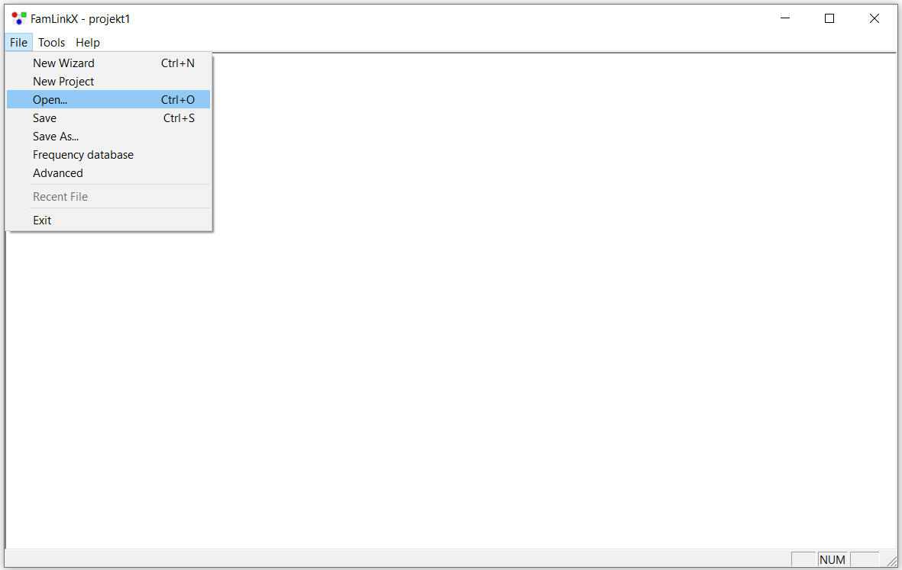

- kontrola načítania - `File/Frequency database`

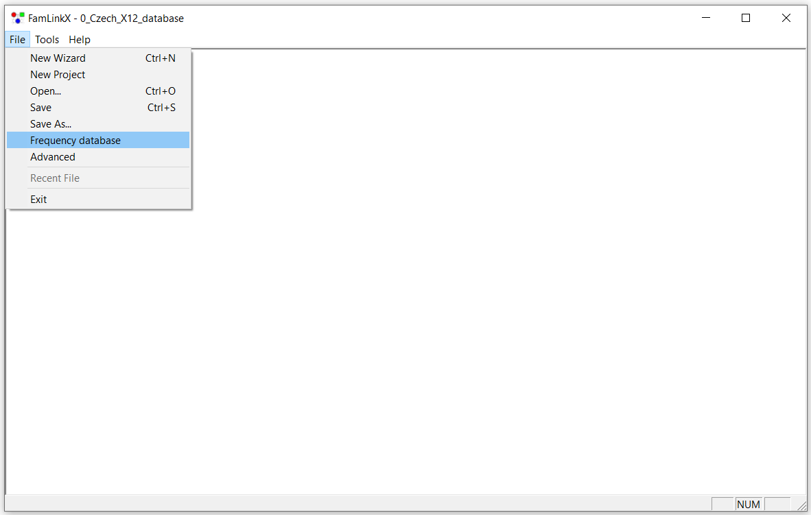
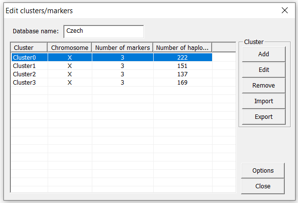

- Dvojklikom na klaster zobrazíme jeho údaje

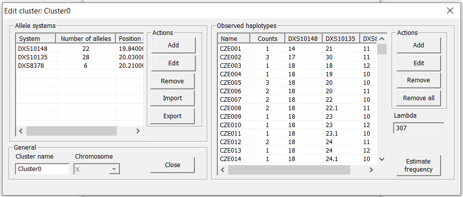
  
+ pri vytváraní novej databázy sa údaje vkladajú priamo sem

##### Vstupné údaje

- obsahujú všetky osoby (v riadkoch)
- stĺpce sú hodnoty jednotlivých aliel pre každého člena
- na začiatku sú v stĺpcoch chromozómy, ktoré sú porovnávané (X/Y)

+ pred analýzou je potrebné údaje skontrolovať, prípadne doplniť 

##### Nastavenie hypotéz

- vkladanie údajov o príbuzenstve

+ `File/New Wizard`
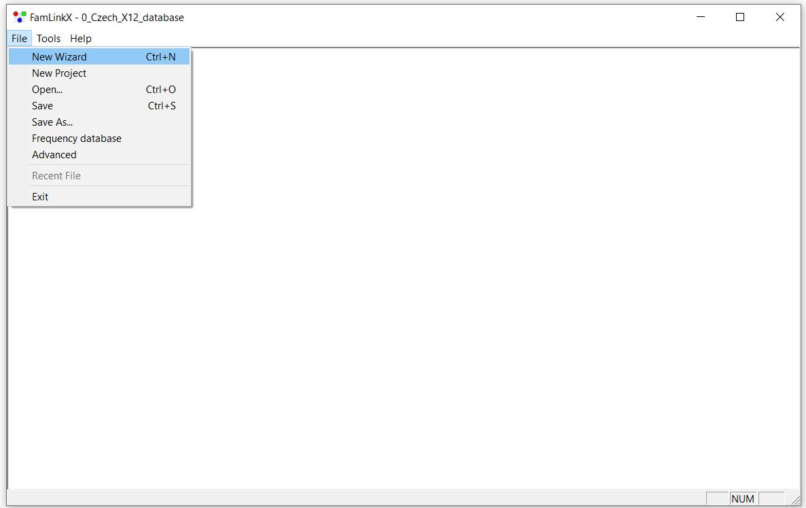

  ##### H0 - základná (nulová) hypotéza
    
    - predpoklad rodokmeňa príbuzenstva

    + napr.  žijúca stará mama (mama otca), mama a dieťa **sú** príbuzné, otec nie je žijúci -> **dieťa je vnučkou starej mamy**
  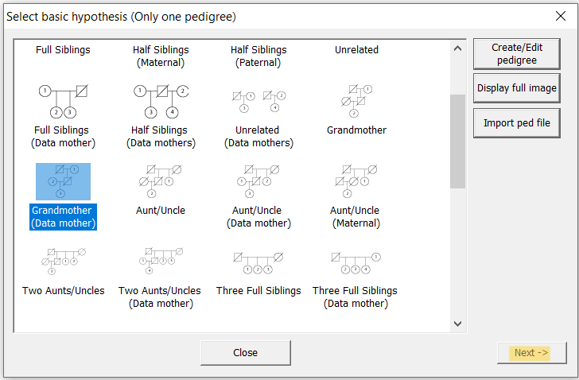

    ##### HA - Hx - alternatívna hypotéza (viacero ďalších hypotéz)
    - Doplnok k H0
    - FamLinkX zobrazuje dostupné alternatívne hypotézy podľa zadanej H0 (môže ich byť viac, potrebné vybrať správne)

    + napr.  žijúca stará mama (mama otca), mama a dieťa **nie sú** príbuzné, otec nie je žijúci -> **dieťa nie je vnučkou starej mamy**
   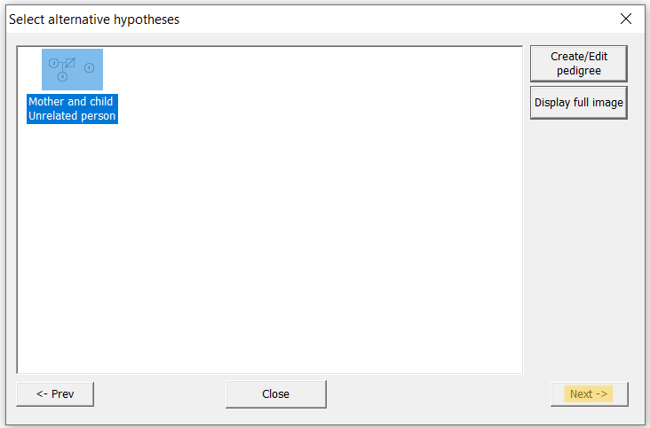
+ pokračujte cez tlačidlo `Next` 
 
##### Vloženie údajov do rodokmeňa

- definovanie pre jednotlivé osoby, podľa čísel v rodokmeni

+ tlačidlo `Import data`

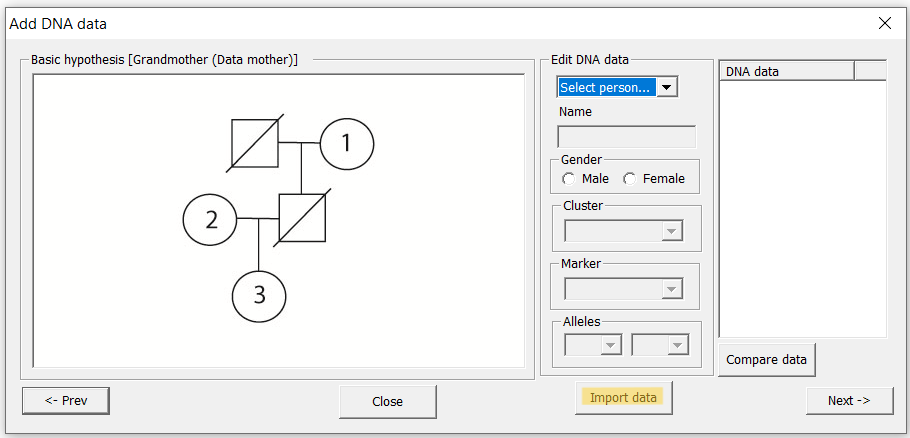

+ v okne `Import options` je zobrazený názov osoby, ktorá sa aktuálne importuje, je potrebné ju priradiť k správnemu číslu osoby (1, 2, 3)

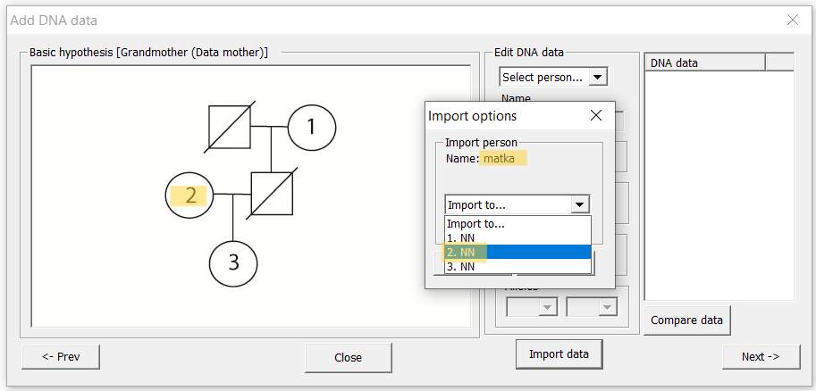

+ po načítaní všetkých osôb v okne Add DNA data **skontrolujte vlastnosti všetkých osôb** pomocou postupného výberu osôb v oblasti `Edit DNA data`.

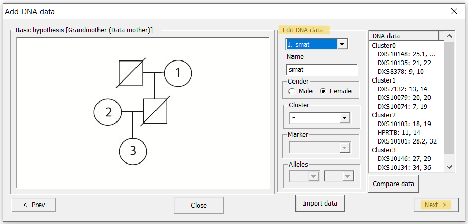

+ pri správnom načítaní pokračujte cez tlačidlo `Next`

##### Výpočet pravdepodobností pre hypotézy

- možnosť nastaviť predpokladané hodnoty hypotéz pred analýzou (prior hypothesis), inak predpokladáme že majú rovnakú pravdepodobnosť

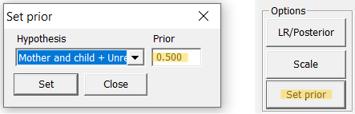

- výpočet - tlačidlo `Calculate`

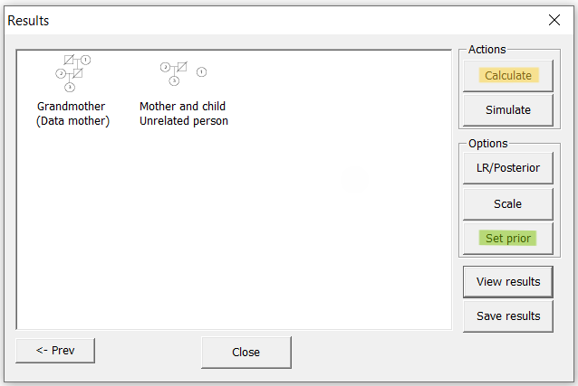
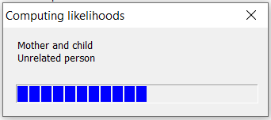

##### Výsledky analýzy

+ tlačidlo `LR/Posterior` - Zobrazenie LR (Likelihood Ratio) hypotéz alebo W - pravdepodobnosť hypotézy

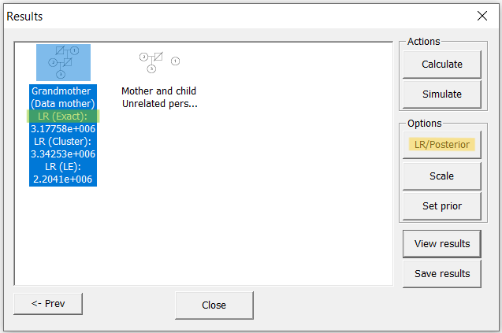

- pravedpodobnosť hypotézy - výpočet pomocou vzorca:

+ W = P(H0|údaje) = LR/(LR+1)  (LR z výpočtu FamLinkX)

+ Priklad: LR = 20 pre H0
    - W = 20/(20+1) = 0,95 -> pravdepodobnosť H0 je 95%
 
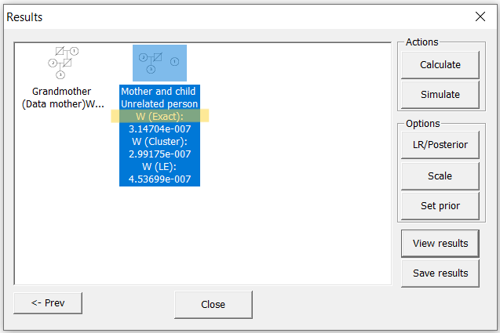
 
##### Interpretácia výsledkov

- úlohou bolo zistiť, či muž bol otcom dcéry, a dievča je vnučkou starej mamy

- H0 - muž je otcom dcéry a vnučka so starou mamou sú príbuzné
- HA - muž nie je otcom dcéry a preto nie sú príbuzné

- pravdepodobnosť potvrdenia hypotézy H0 je 99,922%
- pravdepodobnosť potvrdenia hypotézy HA je 0,078%

- Hypotéza H0 je výrazne pravdepodobnejšia (takmer 100%), preto môžeme prijať hypotézu H0 a aj keď nepotvrdzuje otcovstvo na 100%, môžeme tvrdiť, že dcéra je a vysokou pravdepodobnosťou potomkom muža, a teda vnučkou starej mamy. 

##### Uloženie výsledkov

- FamLinkX ponúka možnosť vygenerovania reportu z výsledkov
- tlačidlo `Save results/Výber typu reportu` - napr. `Case report` - vygeneruje RTF dokument s podrobnými výsledkami analýzy.

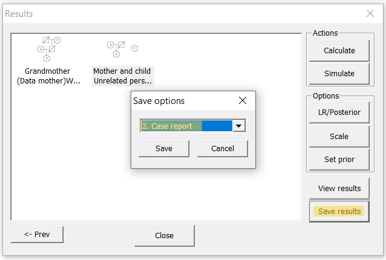

