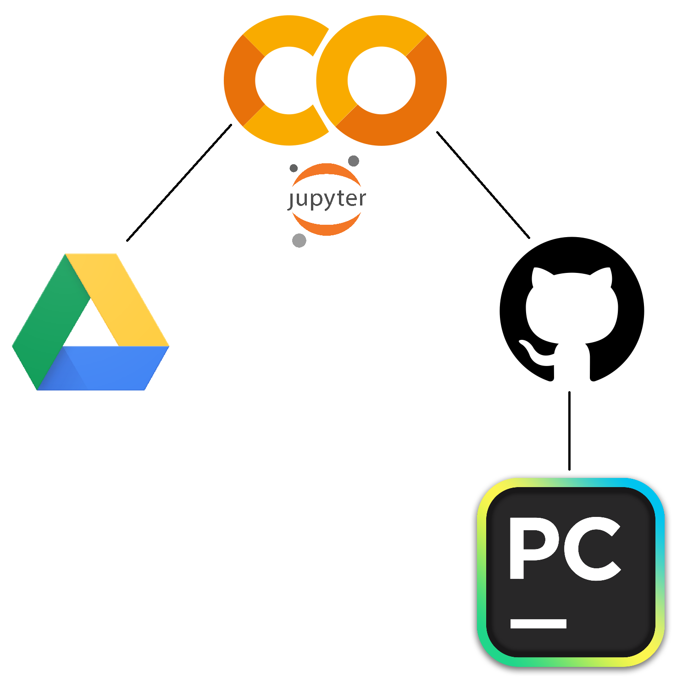

# Zhrnutie Cvičení

### 1. Práca s medicínskymi databázami
- Získavanie údajov
- Vyhľadávanie publikácií
- Medicínske štandardy

### 2. Práca s údajmi
- Predspracovanie
- Exploračná analýza
- Vizualizácia
- Spracovanie
- Interpretácia

### 3. Nástroje
#### Programovacie jazyky / Frameworky
- R - najmä štatistika
- Python - strojové učenie a vizualizácia, množstvo knižníc, virtuálne prostredia
- Shiny - prototyp aplikácie
#### Software
- MetaboAnalyst
- Galaxy
- FamLinkX

### 4. Strojové učenie
- Balansovanie množiny údajov
- Modely strojového učenia
- Optimalizácia parametrov modelov
- Trénovanie a testovanie modelov
- Evaluácia modelov
- Experimenty a interpretácia výsledkov

### 5. Medicínske oblasti
- Genomika
- Metabolomika
- Fylogenetika
- Datasety s rôznymi ochoreniami

### 6. Prostredia
- Jupyter
- PyCharm
- Github

## Dodatočné info

- **Google Colab:**
    - Hostovaná služba, nevyžaduje žiadne nastavenie a poskytuje bezplatný prístup k výpočtovým zdrojom vrátane GPU a TPU.
    - Vhodný na strojové učenie, data science, deep learning a pod.
    - Používa Jupyter notebooky *(* **:(:** *)* - Pycharm Enterprise podporuje aj prácu s Jupter notebookmi
    - Veľmi používaný a oplatí sa ho použiť napr. pri diplomovke
 
- Podporuje spoluprácu s Gitom a Google službami ako napr. Google Drive (úložisko dát)
- Bash príkazy

- Set-up prostredia:

- Užitočné návody na rozbehanie do budúcna:
    - [Google Colab tutorial](https://www.tutorialspoint.com/google_colab/index.htm)
    - [How to use Google Colab with GitHub via Google Drive](https://medium.com/analytics-vidhya/how-to-use-google-colab-with-github-via-google-drive-68efb23a42d)
    - [How to use Google Colaboratory to clone a GitHub Repository to your Google Drive?](https://medium.com/@ashwindesilva/how-to-use-google-colaboratory-to-clone-a-github-repository-e07cf8d3d22b)
    - [Google Colab integration with Github](https://github.com/WiktorJ/google-colab-tutorial)
    - [How Can I Run Notebooks of a Github Project in Google Colab](https://saturncloud.io/blog/how-can-i-run-notebooks-of-a-github-project-in-google-colab/)