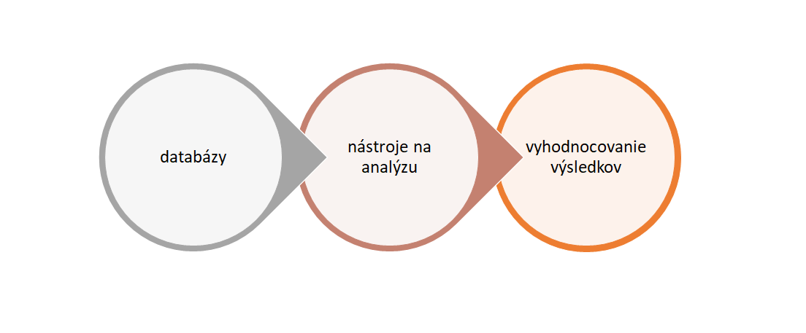
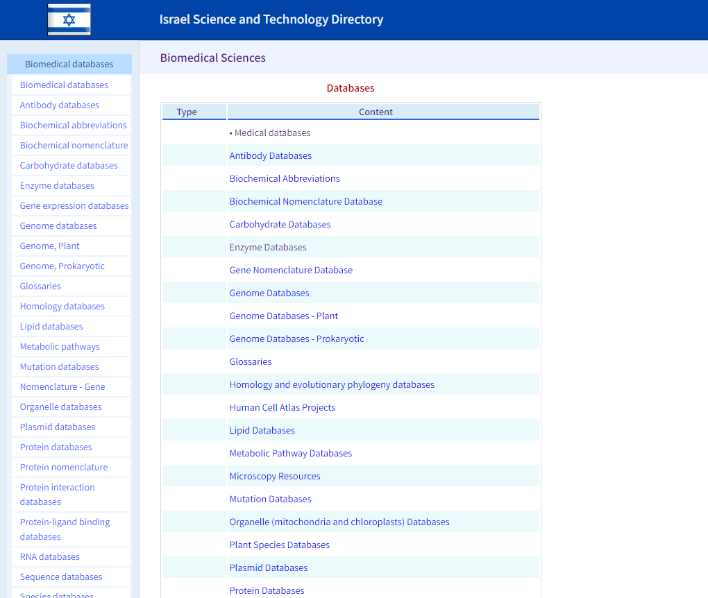
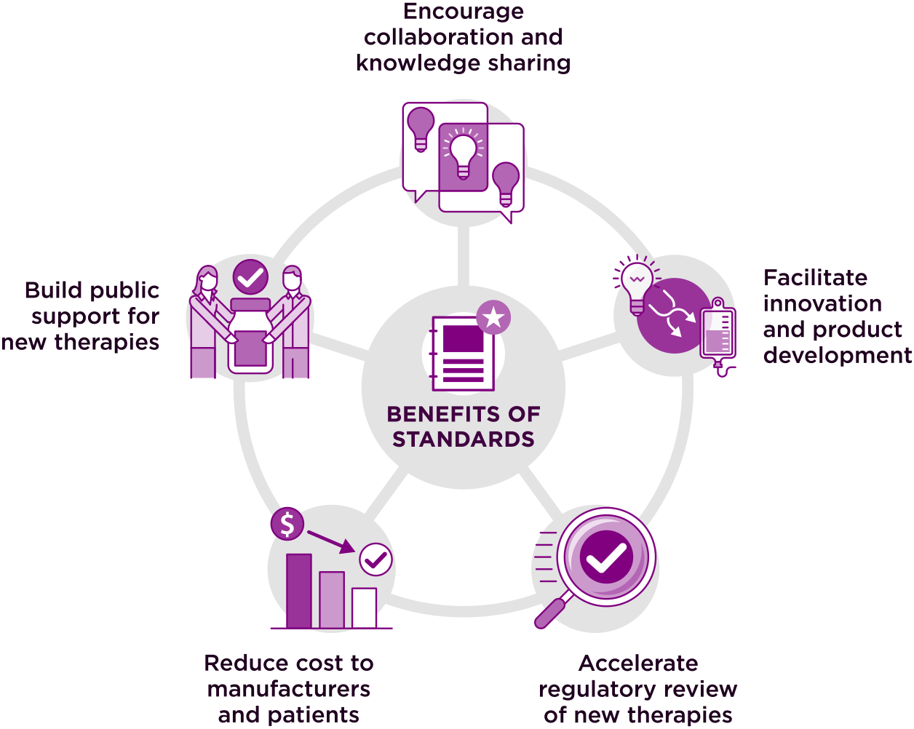
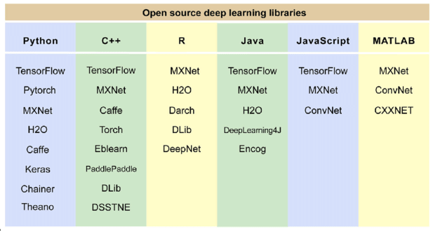
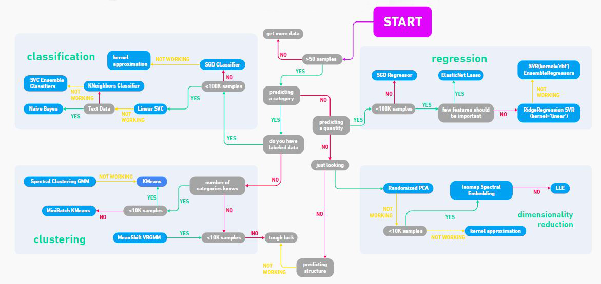
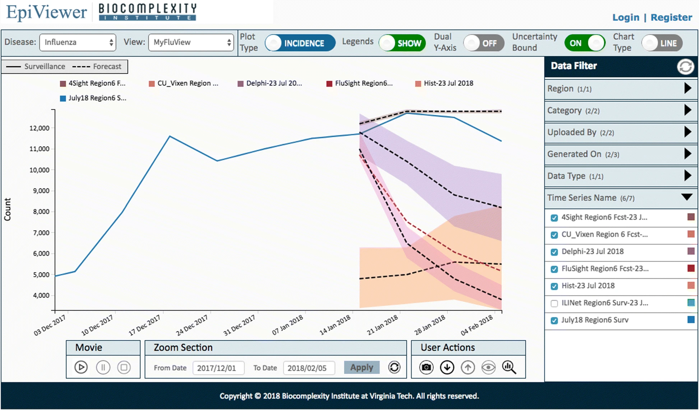

# SSBU CV1: Úvod do softvérových nástrojov pre analýzu biomedicínskych dát

## Nástroje v bioinformatike

#### Databázy
- získanie informácií na identifikáciu problému a formovanie hypotéz
- získanie dostatočného množstva údajov na experimenty a validáciu
- viac relevantná vzorka (opatrne s kombinovaním databáz z rôznych kontinentov)

+ metadatabázy - zhromažďujú údaje o údajoch, pre generovanie nových údajov
+ prehľad biomedicínskych databáz -  www.science.co.il/biomedical/databases/

- najznámejšie databázy v genetike:
  + EMBL's European Bioinformatics Institute - www.ebi.ac.uk
  - National Center for Biotechnology Information -  www.ncbi.nlm.nih.gov
  - University of California, Santa Cruz - www.genome-euro.ucsc.edu/cgi-bin/hgGateway
  - DNA DataBank of Japan - www.ddbj.nig.ac.jp/search/en 

##### Štandardy
- protokoly pre štruktúrovanie, ukladanie a výmenu
- zabezpečenie interoperability údajov
- urýchlenie výskumu
- relevantné metadáta
- základné štandardy:
  - FASTA - sekvencie DNA
  - DICOM - obrazové údaje
  - SNOMED CT - klinická terminológia
  - BioPAX - údaje o biologických dráhach
  - HL7 - klinické a administratívne dáta
  - množstvo ďalších

 
    
##### Spolupráca databáz
- pochopenie súvislostí
- odhalenie komplexných závislostí
- spolupráca na globálnej úrovni 
- projekty:
  - Human Genome Project (HGP) - mapovanie a sekvenovanie ľudského genómu
  - International Cancer Genome Consortium (ICGC) - genetické zmeny v rôznych typoch nádorov 

----
#### Nástroje na analýzu
- množstvo existujúcich nástrojov : online/desktop
   - online - Galaxy, GenePattern, FIJI, ..
   - desktop - PyMOL, GeneiousPrime, 3DSlicer, ..
- programovacie jazyky + knižnice (Python, MATLAB, R, C++, ..)

   
+ výber správneho nástroja / knižnice
+ určiť si potrebné metódy pre spracovanie a analýzu
   + typ údajov (obrazové, signálové, textové, číselné, ..)
   + matematické metódy pre spracovanie, algoritmy strojového/hlbokého učenia a pod. ()
   + metriky pre vyhodnocovanie
+ vizualizácia údajov - pochopenie štruktúry a distribúcie údajov, identifikácia vzorov a anomálií

----
#### Nástroje na vyhodnocovanie výsledkov
- môžu byť súčasťou nástrojov na analýzu, alebo samostatne
- najmä nástroje na vizualizáciu komplexných výsledkov v zrozumiteľnej forme a vytváranie grafov
- prezentácia výsledkov výskumu
- možnosť sledovania trendov (epidemiologická situácia)
- dôležité pre podporu rozhodovania ďalšieho smerovania výskumu
- príklady nástrojov:
   - nástroje - Prism (GraphPad), SAS (Statistical Analysis System), SPSS (Statistical Package for the Social Sciences), Tableau ..
   - knižnice:
      - Python - NumPy, Pandas, Matplotlib, SciPy, Statsmodels, ..
      - R - ggplot2, dplyr, caret, tidyr, ..
      - MATLAB - Statistics and Machine Learning Toolbox, Bioinformatics Toolbox, Curve Fitting Toolbox, ..
      - C++ - Boost.Mathm Eigen, Armadillo, ..

----
##### Referencie
www.science.co.il/biomedical/databases/

www.standardscoordinatingbody.org/standards-benefits

www.researchgate.net/figure/Open-source-DL-research-libraries-with-major-programming-languages-including-Python-C_fig2_340708562

www.geeksforgeeks.org/flowchart-for-basic-machine-learning-models/

www.bmcbioinformatics.biomedcentral.com/articles/10.1186/s12859-018-2439-0