# SSBU CV1: Úvod do softvérových nástrojov pre analýzu biomedicínskych dát

## Práca s databázami

#### National Center for Biotechnology Information 
- súbor biomedicínskych a biotechnologických databáz
- voľne prístupné - www.ncbi.nlm.nih.gov/
- GenBank - DNA databáza
- PubMed - publikačná databáza

##### GenBank
- prístup buď cez Google Search: genbank, alebo priamo - www.ncbi.nlm.nih.gov/genbank/

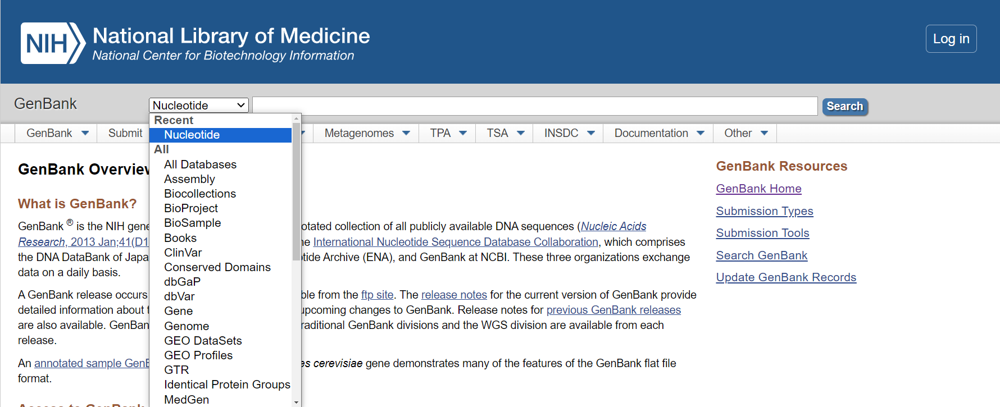

- vyhľadávanie - možnosť vybrať si konkrétnu databázu a hľadať konkrétny gén v orghanizme (napr. P53 homo sapiens)
   - v rámčeku na začiatku výsledkov sú zobrazené informácie o hľadanom géne ako aj jeho ďalšie kódovania

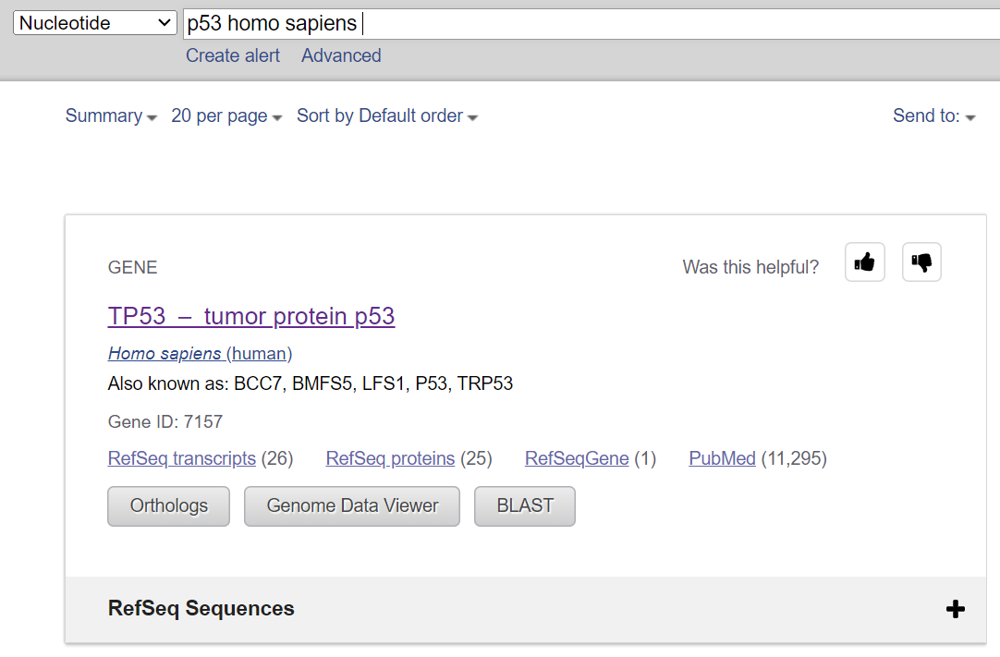

- taxonómia - zaradenie organizmov (druh, rod, čeľaď, ..) na základe ich vzájomných príbuzenských a evolučných vzťahov
   - zobrazenie vo forme listu alebo stromu

 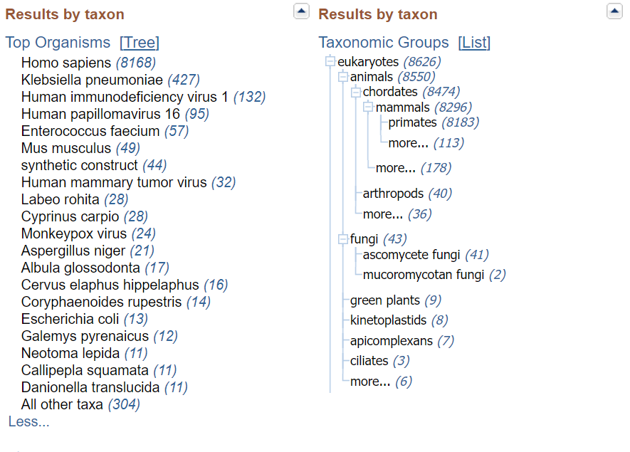
 
+ výsledky vyhľadávania - označenie
   +  kompletná alebo čiastočná kódovacia sekvencia (complete cds/partial cds)
   + prístupové číslo - AB082923.1
   + GenInfo Identifier - 23491728

 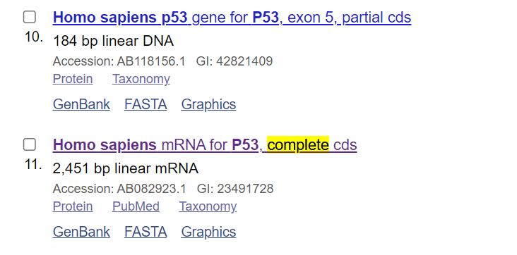
     
+ zobrazenie výsledku - po otvorení vybraného výsledku (napr. Homo sapiens mRNA for P53, complete cds)
   + štruktúrovaná forma

   + základné údaje
  
 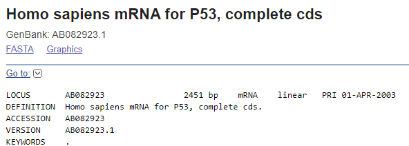

   + zdroj a organizmus

 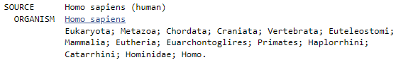
  
   + informácie o publikácii
 
 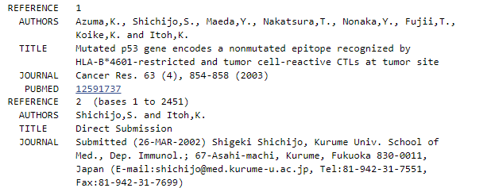
  
   + sekvencia (súbor údajov) - originálna nukleotidová sekvencia proteínu

 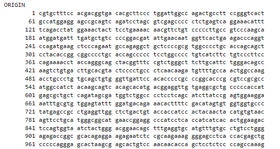
  
   + vlastnosti - metadáta
  
  
  
   + zdroj, gén a kódovacia sekvencia CDS (kliknutím sa sekvencia zvýrazní v pôvodných údajoch)

 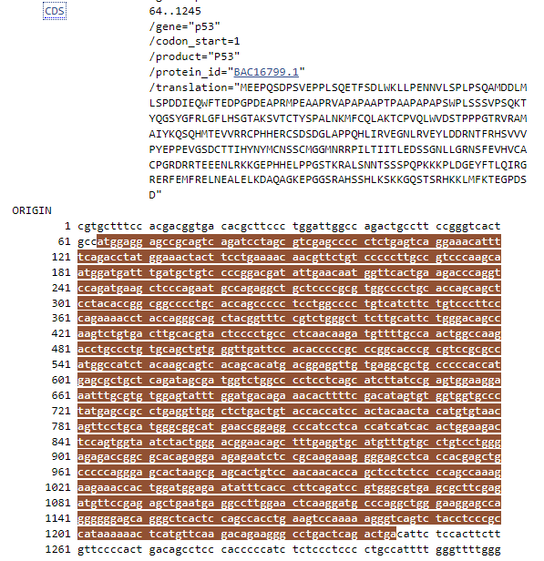
 
   + translácia - preklad genetickej informácie nukleotidov na poradie aminokyselín

 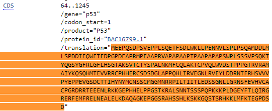

   + Kódovanie aminokyselín:
     
 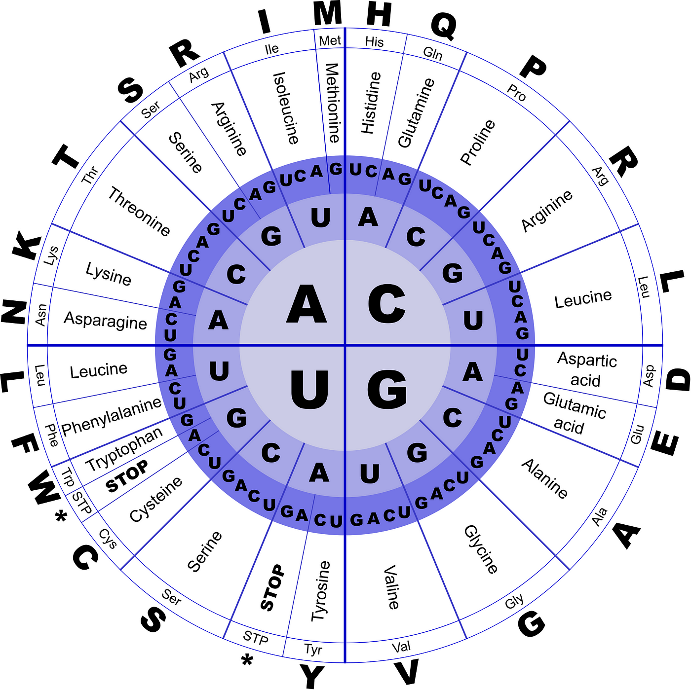
 
   + zobrazenie detailov - spodný panel - dobré pri dlhých pôvodných sekvenciách (ostáva na obrazovke pri posúvaní sa smerom dolu)

 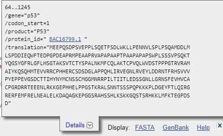
   
   - export údajov do súboru

 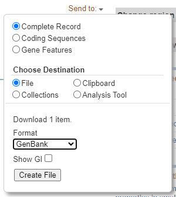
 
   - formát sekvencie
     - FASTA
     - Grafický
       
 
  
 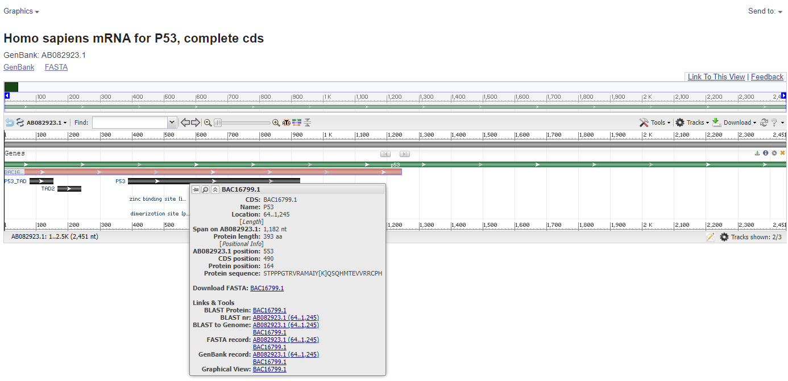
  
 - zobrazenie detailov - nabehnutím myšou na jednotlivé úseky (región, poloha, dĺžka, odkazy na databázy)

   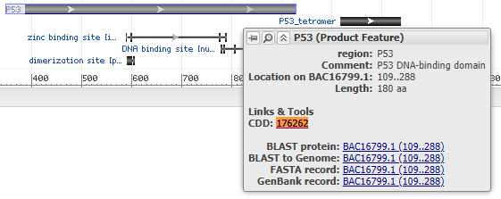
   
 - CDD (Conserved Domain Database) - anotácie proteínov, popis funkcie génu (zobrazenie podrobnejších informácií - obrázok, vlastnosti, taxonómia, ..)

  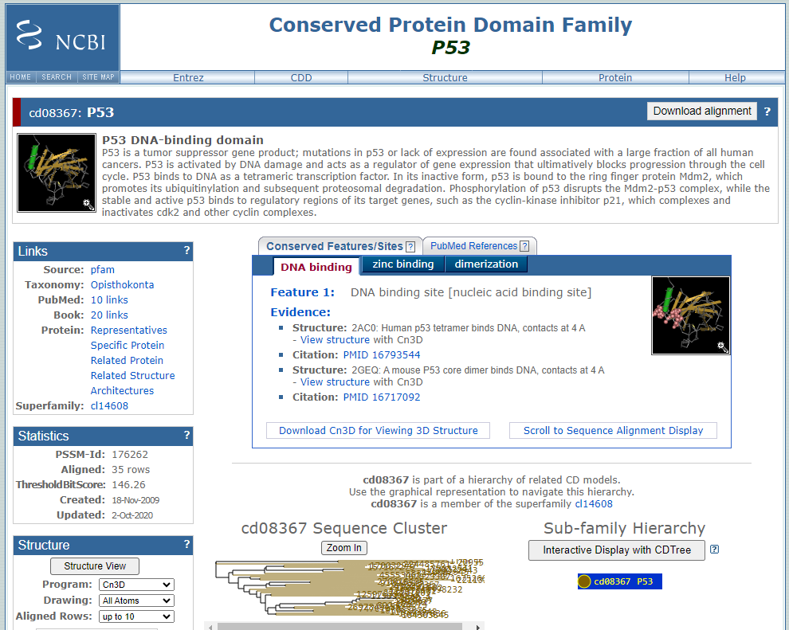
             
##### PubMed
- prístup buď cez Google Search: pubmed, alebo priamo - www.pubmed.ncbi.nlm.nih.gov/

 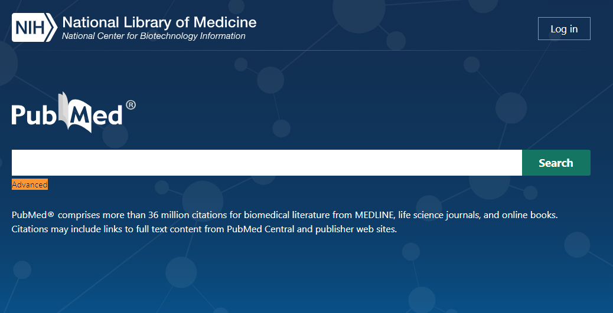
 
- jednoduché vyhľadávanie alebo možnosť "Advanced"
  - vytváranie dotazu podľa konkrétnych atribútov, alebo ich kombinácie (dáva aj nápovedu)

 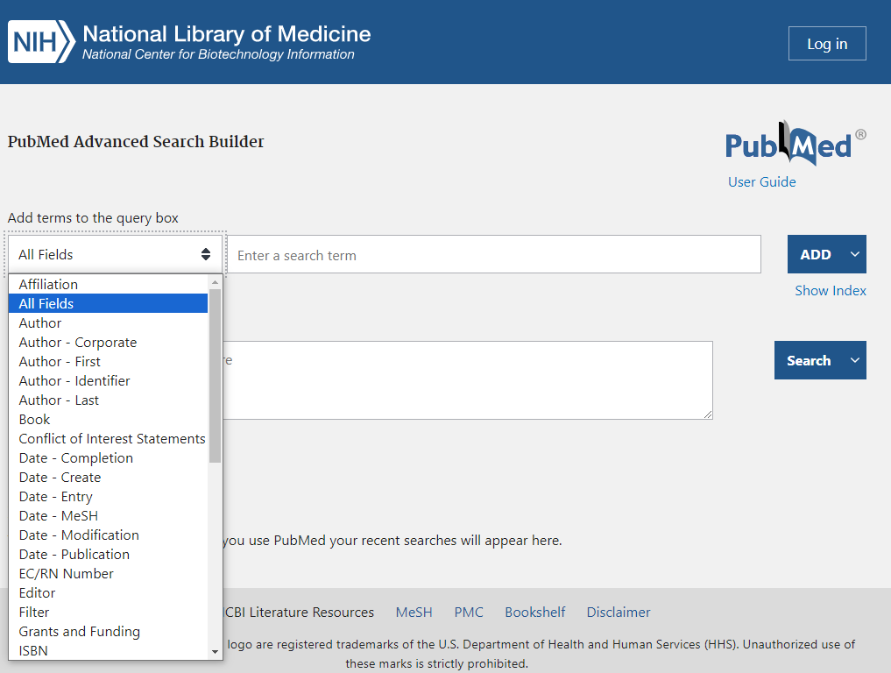
 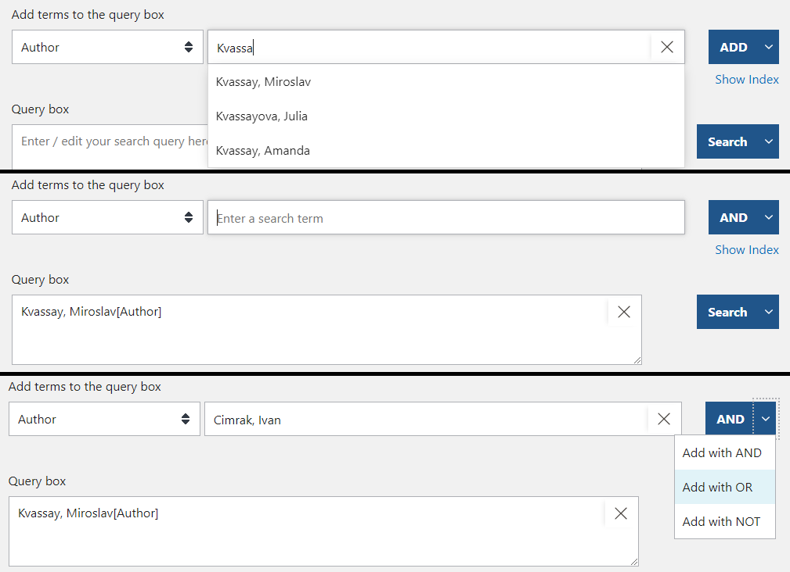
 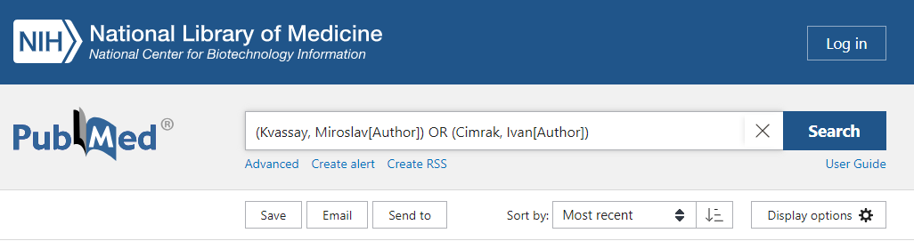
 
- zoradenie výsledkov

 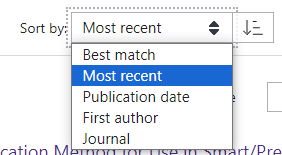
 
- filtrovanie výsledkov (full text, free full text)

 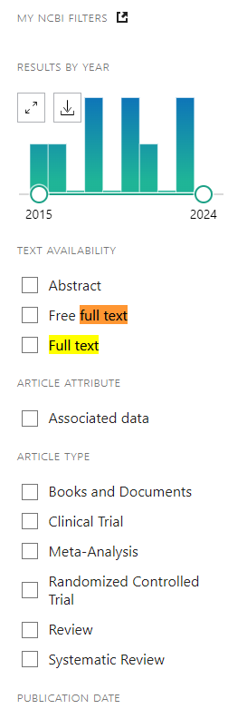

- výsledky vyhľadávania

 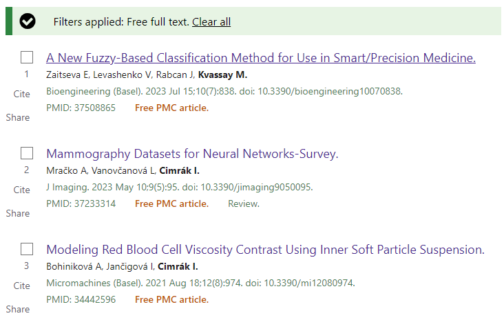

- detailné zobrazenie článku
   - PMID (PubMed Identifier), PMCID (PubMed Central Identifier), DOI (Digital Object Identifier)

  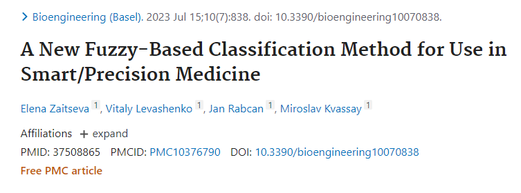
 
   - abstrakt a kľúčové slová

  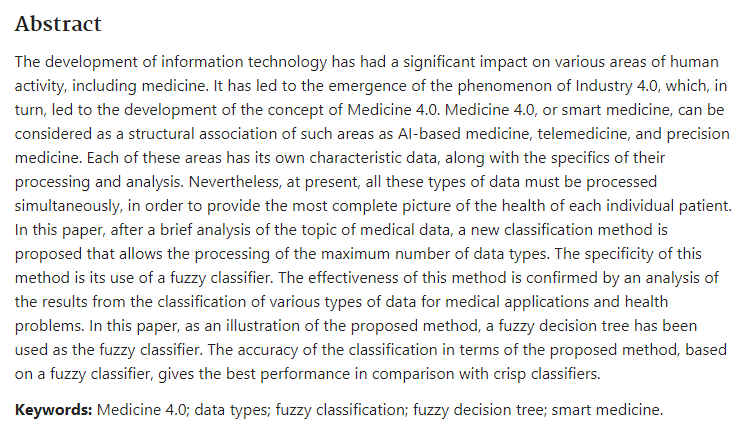
  
   - obrázky

  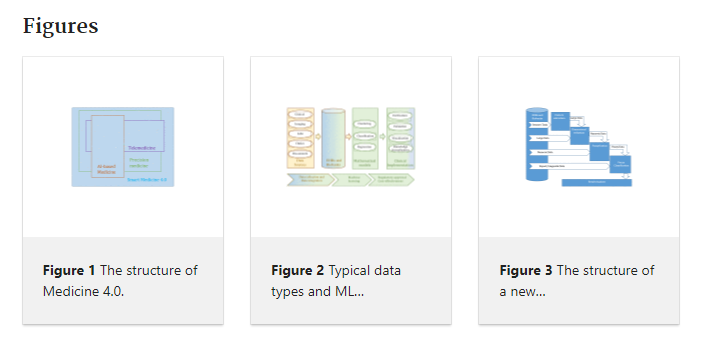
  
   - podobné články

  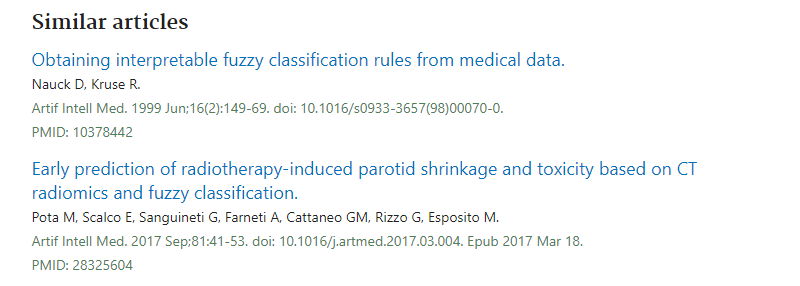
  
   - citácie článku

  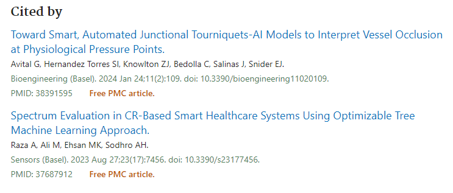

   - referencie v článku

  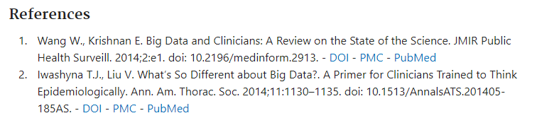

   - link na celý obsah článku
 
  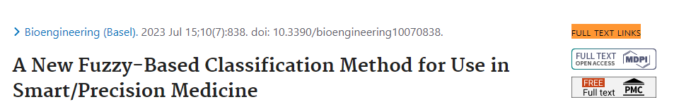
  
   - vygenerovanie citácie, výber formátu citácie

  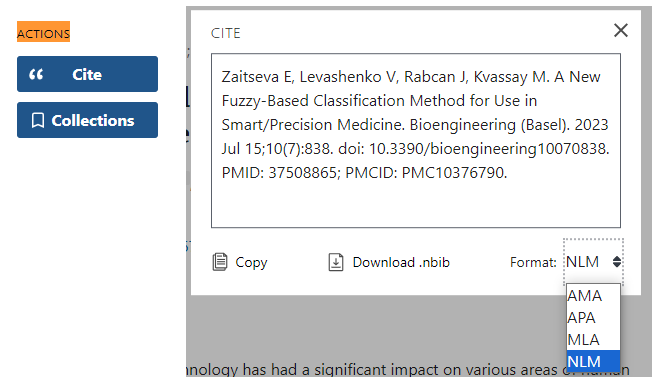

   - stiahnutie do súboru (citácia, abstrakt, PMID, ..)

  

  

----
##### Referencie
https://towardsdatascience.com/starting-off-in-bioinformatics-rna-transcription-and-translation-aaa7a91db031

www.ncbi.nlm.nih.gov/genbank/

www.pubmed.ncbi.nlm.nih.gov/
