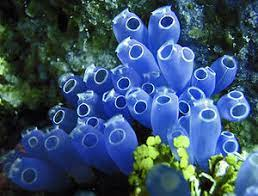
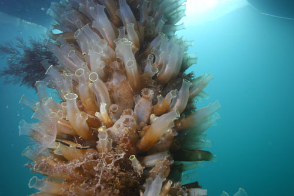

# SSBU CV1: Úvod do softvérových nástrojov pre analýzu biomedicínskych dát

## Úlohy

##### 1. GenBank

1.1.a. V databáze Genbank Nucleotide vyhľadajte "INS tunicates" (vyhľadanie INS génu)
   - Tunicates je druh živočíchov - Plášťovce
     
  

1.1.b. Aký je názov hľadaného kódovaného génu ? (Názov nájdete v rámci "GENE" na začiatku vyhľadávania). Ako sa tento gén nazýva pri hľadaní u človeka ("INS homo sapiens") a aké sú jeho iné kódovania ?

1.1.c. Vo vyhľadávaní pre gén "INS tunicates" vyberte sekvenciu mRNA pre organizmus Ciona intestinalis (Sumka trubičkovitá). Napíšte jej taxonomické zaradenie (nájdete v ORGANISM)

  

1.1.d. Vo vlastnostiach nájdite reťazec kódovaných aminokyselín (transláciu):

----

##### 2. PubMed

2.1.a. V databáze PubMed pomocou rozšíreného hľadania vyhľadajte článok ktorého autorom je Brian J North a v názve článku sa nachádza "Cardiovascular Disease" (atribút Title)

2.1.b. Vytvorte citáciu článku vo formáte APA:

2.1.c. Stiahnite si do súboru informácie o článku vo formáte Abstract (text) a nájdite v ňom pracovisko (fakultu) prvého autora článku (v sekcii Author Information):

-----
2.2.a. V databáze PubMed pomocou rozšíreného hľadania vyhľadajte články ktorých autorom je Jianping Jia a boli publikované v časopise "The New England journal of medicine" (atribút Journal)

2.2.b. Zoraďte zoznam výsledkov od najnovších (Most recent) a otvorte prvý článok (Biomarker Changes during 20 Years Preceding Alzheimer's Disease.)

2.2.c. V zobrazení článku medzi podobnými článkami nájdite článok s názvom: "A data-driven model of biomarker changes in sporadic Alzheimer's disease"

2.2.d. Otvorte si tento článok a pomocou prepojení zobrazte celý text článku

2.2.e. Napíšte DOI článku a dátum jeho online publikácie (publikovaný v časopise Brain bol v Septembri 2014, online bol publikovaný skôr)

----
##### Referencie

https://www.coraldigest.org/index.php/Tunicates

https://www.embrc-france.fr/en/nos-services/fourniture-de-ressources-biologiques/organismes-modeles/ciona-intestinalis-sea-squirt