# SSBU CV2: Úvod do R

## Inštalácia potrebných nástrojov

#### Inštalácia Python

Potrebné stiahnuť inštalačný súbor - www.python.org/downloads/

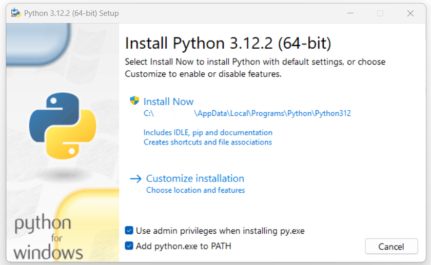

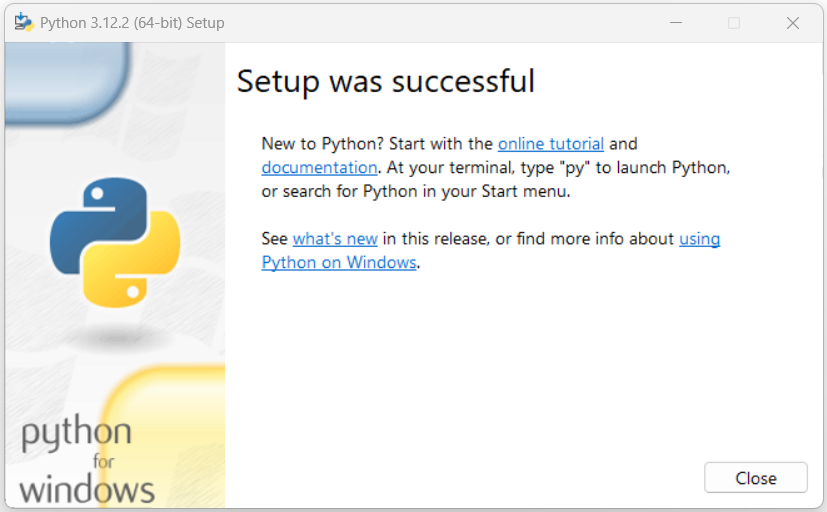

V príkazovom riadku:
- Overenie nainštalovanej verzie Pythonu:
`python -V`

- Overenie nainštalovanej verzie Pip:
`pip -V`

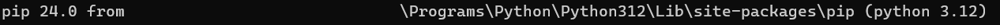

----

#### Inštalácia Jupyter Lab

V príkazovom riadku:
- inštalácia jupyter lab
`pip install jupyterlab`

- spustenie jupyter lab
`jupyter lab`

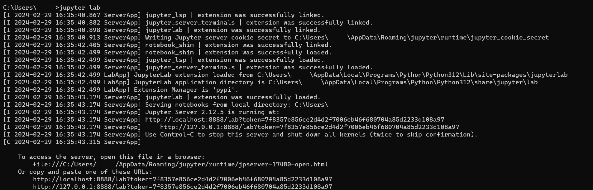

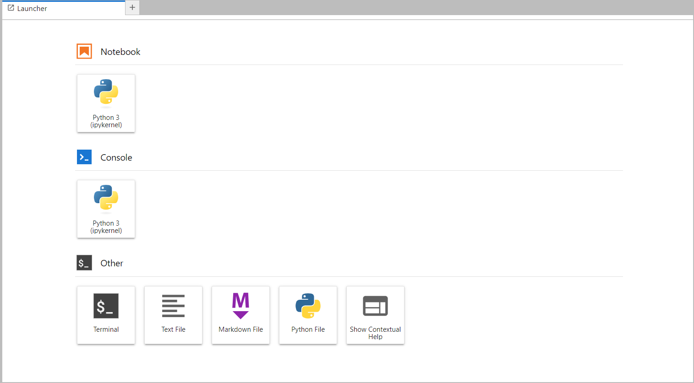

----
#### Inštalácia R

Potrebné stiahnuť inštalačný súbor - www.cran.r-project.org/bin/windows/base/

- stačí preklikať cez "Next"

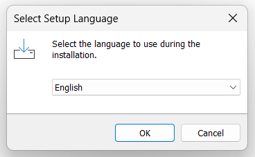
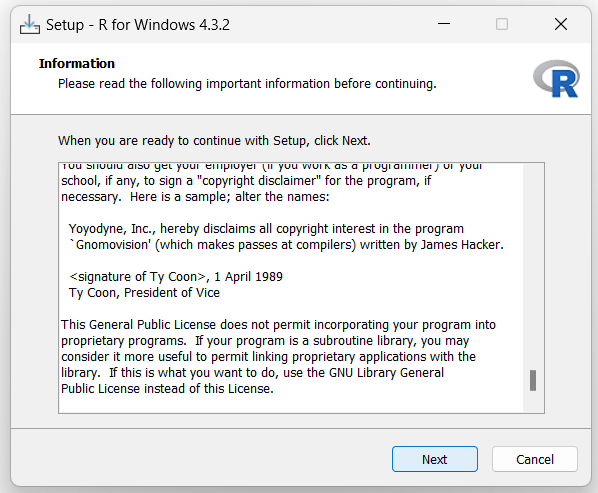
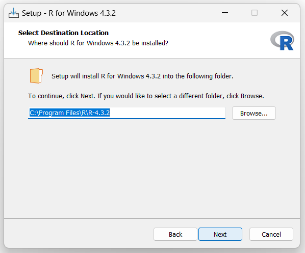

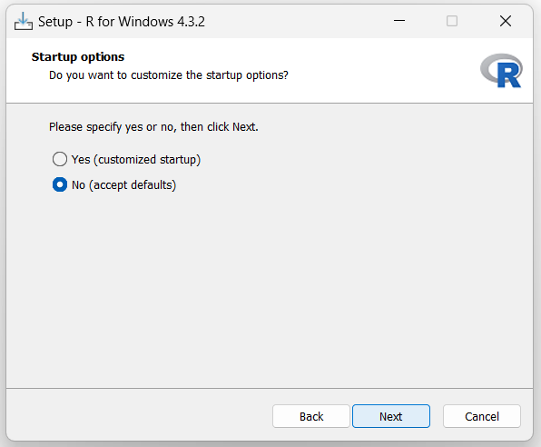
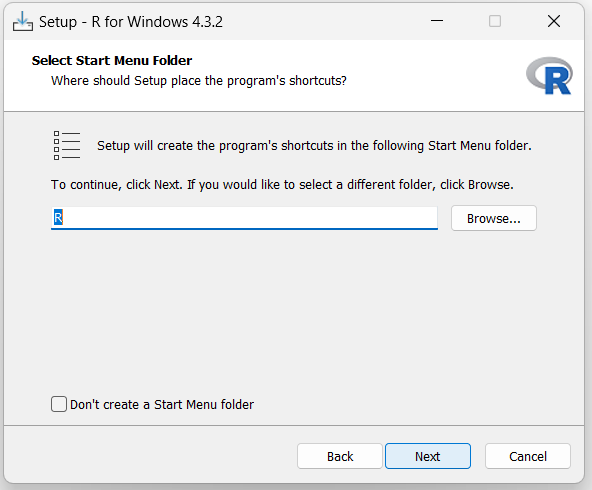

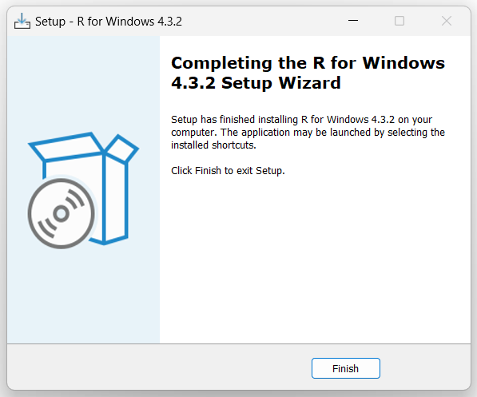

----
#### Inštalácia R kernelu

V príkazovom riadku:
- Zobrazenie dostupnych jupyter kernelov:

`jupyter kernelspec list` 

Spustenie R v konzole (z miesta kde sa nachadza R.exe (podľa inštalácie), predvolene C:\ProgramFiles\R\bin) - **spustiť ako administrátor**

V R konzole:

`install.packages('IRkernel')`

V R konzole:

`IRkernel::installspec()`

`quit()`

`Save workspace image?: n`

----
#### Clone/Fork Git repozitára
(ak ešte nemáte)

##### Clone
V príkazovom riadku:

`git clone https://github.com/fri-linda/SSBU`

`git checkout ssbu_cv2`

##### Fork

- Na Githube nájdete repozitár https://github.com/fri-linda/SSBU
- Napravo je tlačidlo Fork - fork vytvorí kópiu repozitára na vašom Github účte a prepojí ju s pôvodným repozitárom.

- Odznačte checkbox "Copy the master branch only"
  

- Pomocou tlačidla "Sync fork" si synchronizujete zmeny v pôvodnom repozitári s vaším repozitárom 
  

Následne je ešte potrebný clone svojho repozitára.

#### Vytvorenie R skriptu v Jupyter Lab

V príkazovom riadku v naklonovanom git repozitári:

- spustenie jupyter lab
  
`jupyter lab`

- už je dostupný aj R kernel
- Vyberte R skript

- Zobrazenie aktuálneho kernelu - R, Python

- Vytvorenie novej bunky v skripte

- Možnosti skriptu - uloženie, nová bunka, spustenie bunky/skriptu ..
    - Typ bunky - Markdown - formátovaný text, Code - spustiteľný kód, Raw - text 

- Výstup pre bunku po spustení skriptu

