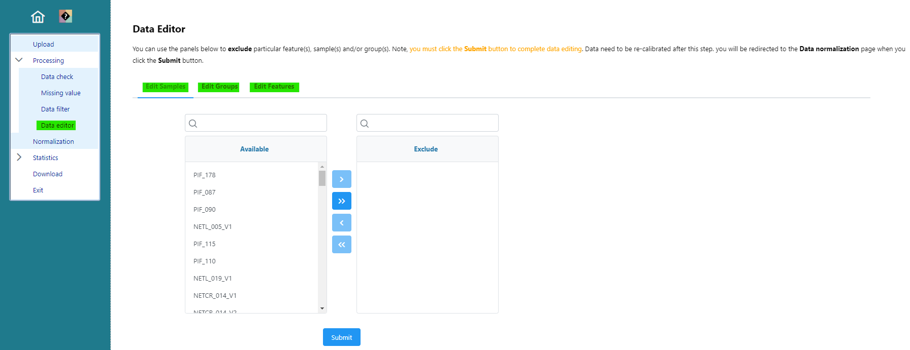
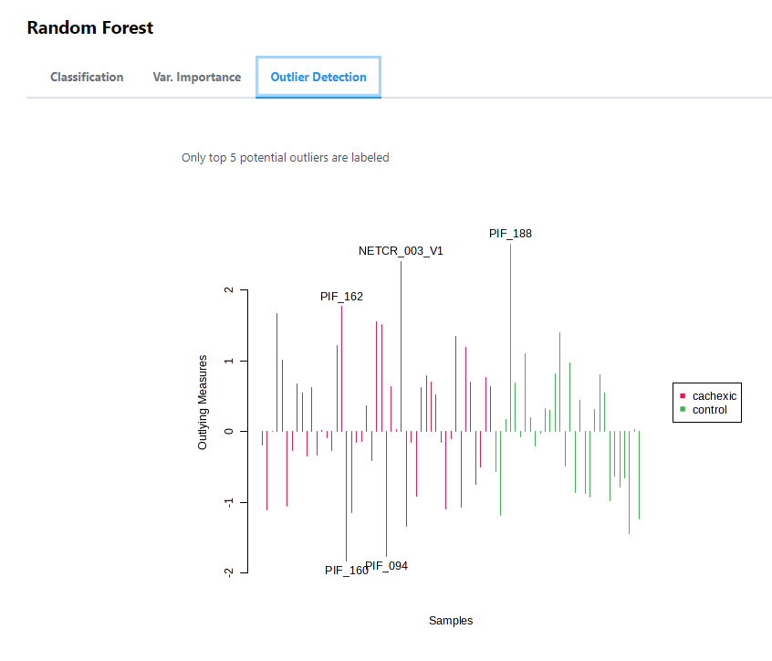

# SSBU CV2: Softvérové nástroje na analýzu biomedicínskych údajov

## MetaboAnalyst

#### Prehľad

##### Metabolit

- Chemická látka, ktorá je súčasťou metabolických procesov v organizmoch (zložky alebo medzivýrobky metabolických dráh)
- Podieľa sa na rôznych biochemických procesoch - energetický metabolizmus, syntéza biomolekúl, rozklad živín alebo detoxikácia.
- Metabolity môžu byť malé molekuly - cukry, aminokyseliny, lipidy, nukleotidy, alebo väčšie molekuly - hormóny alebo enzýmy.

##### Metabolické údaje

- Metabolické údaje sú informácie o metabolických procesoch a metabolitoch v biologických systémoch.
- Zahrňujú kvantitatívne údaje o koncentráciách metabolitov, enzýmových aktivitách, a ďalších metabolických parametroch.
- Získavajú sa pomocou rôznych analytických metód, ako je hmotnostná spektrometria, NMR spektroskopia, chromatografia atď.
- Užitočné pri štúdiu fyziologických procesov, diagnostike chorôb, farmakokinetike liekov a pochopení biochemických mechanizmov.

+ Príklady metabolických údajov:
    - Koncentrácia glukózy v krvi.
    - Aktivita enzýmov, ako napríklad amyláza, ktorá štiepi škrob.
    - Hladiny rôznych aminokyselín v tkanivách alebo krvi.
    - Koncentrácia laktátu počas anaeróbneho metabolizmu.
    - Obsah kyseliny močovej v moči.
    - Koncentrácia lipidov, ako sú cholesterol, triglyceridy a fosfolipidy v krvnom sére.
    - Aktivita metabolických dráh alebo reakcií, ako je glykolýza alebo beta-oxidácia mastných kyselín.
    - Koncentrácia metabolitov ako kreatín fosfát v svaloch.

##### MetaboAnalyst

- Bezplatný online nástroj pre analýzu metabolických dát.
- Analýza metabolických dát z rôznych zdrojov.
- Poskytuje rôzne nástroje a techniky na analýzu, vrátane štatistických metód a vizualizácií.
- Používaný v bioinformatických a biomedicínskych výskumoch na pochopenie metabolických mechanizmov a ich spojenie s rôznymi fyziologickými a patologickými stavmi, ako sú choroby alebo reakcie na liečbu.
+ dostupný na https://www.metaboanalyst.ca/MetaboAnalyst/ModuleView.xhtml

#### Jednofaktorová štatistická analýza

- Porovnávanie významných rozdielov v jednej kategorickej premennej (faktor) medzi dvoma alebo viacerými skupinami.
- Jednofaktorová analýza porovnáva hodnoty v závislej premennej (výslednej premennej, ktorá závisí od faktoru) medzi dvoma alebo viacerými úrovňami faktoru.
- Základným cieľom jednofaktorovej analýzy je zistiť, či existujú štatisticky významné rozdiely medzi úrovňami faktoru.
- Hlavnou nulovou hypotézou je, že neexistujú žiadne rozdiely medzi skupinami, zatiaľ čo alternatívna hypotéza tvrdí, že aspoň jedna skupina sa významne líši.
- Používajú sa štatistické testy, ako sú analýza rozptylu (ANOVA), Kruskal-Wallis test (v prípade nehomogénnych dát) alebo chi-kvadrát test (v prípade kategorických dát).

1. Vyberte Nástroj pre jednofaktorovú štatistickú analýzu

2. Vyberte dáta pre analýzu
    - v sekcii 'Try our test data' vyberte dataset Koncentrácií z publikácie:
       - Metabolite concentrations of 77 urine samples from cancer patients measured by 1H NMR (Eisner R, et al.). Group 1- cachexic; group 2 - control 
    - pomocou tlačidla `Submit` potvrdíte výber datasetu

    + **Pri nahrávaní vlastných údajov zvyčajne použijete nahranie súboru ako textový súbor (.txt alebo .csv). Zvyčajne sú v datasete uvedené koncentrácie jednotlivých látok, ktoré máte dané ako premenné. Pokiaľ by dataset bol spracovaný vo formáte Spektrálnych intervalov alebo Intenzít vrcholov, nájdete to pri datasete, alebo v názvoch premenných napísané.**
    + **Podľa toho, v akom formáte sú premenné a vzorky (riadky/stĺpce alebo stĺpce/riadky) vyberte správny `Format` pri načítaní. Pokiaľ nemáte pri datasete napísané, že je určený pre párovú analýzu, vyberte možnosť `unpaired`.**
  

3. Výsledok nahrávania:
    - Skontrolujte, či boli údaje načítané správne (žiadne chyby, stĺpce a riadky obsahujú správne hodnoty, sedí počet vzoriek a skupín faktorovej premennej - napr. 2 (pozitívna a negatívna diagnóza)).
    - Skontrolujte či dataset neobsahuje nejaké chýbajúce údaje (0% missing values were detected).
    - Pokiaľ je všetko v poriadku, môžete pokračovať tlačidlom `Proceed`.

4. Odstránenie chýbajúcich hodnôt a odfiltrovanie údajov (Missing value a Data filter)

    - Pokiaľ pri načítaní boli objavené chýbajúce hodnoty, v menu na ľavej strane je možnosť odstránenia týchto hodnôt v záložke `Missing values`.
        - Môžete napr. odstrániť vzorky, ktoré obsahujú viac ako 50% chýbajúcich hodnôt premenných.

    + V záložke `Data filter` je možné odfiltrovať všetky PREMENNÉ, ktoré nespĺňajú požadované kritériá (môžu byť zanedbateľné pre analýzu)
        + Napr. odstránenie premenných, v ktorých je nízka variancia (pre všetky vzorky je hodnota takmer rovnaká)
    

5. Data editor - manuálne zmeny údajov

    -  V záložke `Data editor` je možnosť robiť manuálne zmeny v datasete - napr. odstránenie konkrétnych vzoriek podľa ich ID, odstránenie niektorých hodnôt z faktorovej premennej (binárna/viacnásobná klasifikácia), prípadne odstránenie konkrétnych premenných

6. Normalizácia údajov

- Chceme, aby distribúcia premenných aj vzoriek mala normálne rozdelenie

   - Normalizácia vzorky - najpoužívanejšie - medián, suma, alebo kvantil (väčšia vzorka)
   - Transformácia údajov - v biomedicínskych dátach najčastejšie logaritmická transformácia, prípadne pomocou druhej alebo tretej odmocniny
   - Škálovanie údajov - najmä škálovanie pomocou priemeru a smerodajnej odchýlky, jej odmocniny alebo rozsahom

- Použitím `Normalize` aplikujeme výber na údaje a pomocou `View Result` môžeme zobraziť prehľad, ako vyzerá rozdelenie po normalizácii. V okne je možné zobraziť distribúciu premenných aj vzorky. Po normalizácii (rozloženie údajov viac pripomína normálne rozdelenie), pokračujte cez `Proceed`.
  

7. Analýza údajov

   - Nástroj ponúka množstvo bežne používaných štatistických metód na analýzu množiny údajov, tieto sú zobrazené v navigačnom paneli v záložke `Statistics`.
   

- Na pravej strane kliknutím na `Show R Commands` viete zobraziť históriu príkazov v R, ktoré boli použité pre vykonanie analýzy. 
- Nástroj MetaboAnalyst je možné použiť aj ako balíček priamo v R kóde. 
    

7.1. PCA
- PCA sa snaží nájsť nové, nezávislé premenné, nazývané hlavné komponenty, ktoré zachytávajú čo najväčšiu varianciu v pôvodných dátach. Tieto hlavné komponenty sú lineárne kombinácie pôvodných premenných, ktoré umožňujú redukciu dimenzionality dátového súboru.
- PCA pomáha identifikovať vzory alebo zákonitosti v dátach tým, že zobrazuje vzťahy medzi jednotlivými pozorovaniami alebo premennými. Pomáha v identifikácii podobností a rozdielov medzi jednotlivými pozorovaniami a skupinami pozorovaní v dátach.
- Prvé komponenty vysvetľujú najväčšiu varianciu v údajoch (avšak nemusí byť dostatočná na odlíšenie vzoriek).
- Scatter Plot grafy párového skóre pre jednotlivé komponenty:

- Scree Plot pre jednotlivé komponenty:
- Snažíme sa v ňom nájsť zlom, pre varianciu vysvetlenú jednotlivými komponentami.

- 2D Scores Plot - rozdelenie vzoriek do jednotlivých komponentov - čo najlepšie oddelenie.

- Synchronized 3D Plots - 3D zobrazenie rozdelenia vzoriek/premenných do prvých komponentov.

7.2. PLS-DA
    
- PLS-DA je účinný nástroj na klasifikáciu dát, ktorý sa snaží identifikovať vzory alebo skryté štruktúry, ktoré rozlišujú medzi rôznymi skupinami alebo triedami v dátach. Pomáha identifikovať hlavné komponenty, ktoré najlepšie oddelujú jednotlivé triedy alebo skupiny v dátach.
- PLS-DA optimalizuje rozlišovanie medzi triedami alebo skupinami v dátach tým, že nájde lineárne kombinácie pôvodných premenných, ktoré najlepšie vysvetľujú varianciu a súčasne rozlišujú medzi triedami. Je vhodnejšia pre kategorické premenné. Často sa používa v bioinformatike a biomedicínskom výskume na identifikáciu biomarkerov alebo diagnostických vzorov.
    

- Important Features - zobrazuje zoznam vybraného počtu najdeskriptívnejších premenných pre vybraný komponent.

- Cross Validation - rozdelenie datasetu na niekoľko rovnakých častí pre klasifikáciu, a trénovanie/testovanie vždy na inej kombinácii častí.
    - Možnosť výberu metriky, podľa ktorej chceme posudzovať najlepšie riešenie
    - R2 - vyjadruje percento variability vysvetlené modelom vzhľadom na celkovú variabilitu dát.
    - Q2 - Q2 je R2, ktoré je vypočítané pomocou krížovej validácie modelu. Miera Q2 poskytuje lepšiu predstavu o schopnosti modelu generalizovať na nové, nevidené dáta.
    - Accuracy - miera úspešnosti klasifikácie modelu, ktorá udáva percento správne klasifikovaných pozorovaní zo všetkých pozorovaní.

7.3. T-test a Wilcoxon rank-sum test

- T-test je parametrický štatistický test, ktorý sa používa na porovnávanie priemerov dvoch skupín dát. Výsledky t-testu poskytujú informácie o tom, či sú priemery dvoch skupín štatisticky významne odlišné alebo nie. Predpokladom pre použitie t-testu je, že dáta sú normálne distribuované a majú rovnakú variabilitu.
- Wilcoxon rank-sum test, (Mann-Whitney U test), je neparametrický štatistický test, ktorý sa používa na porovnávanie distribúcií dvoch skupín dát. Výsledky Wilcoxon rank-sum testu poskytujú informácie o tom, či existujú štatisticky významné rozdiely medzi distribúciami dvoch skupín dát. Na rozdiel od t-testu, Wilcoxon rank-sum test nevyžaduje predpoklad normálnej distribúcie dát ani rovnakú variabilitu.
    

7.4. Correlations

- Zobrazenie vzájomnej korelácie premenných alebo vzoriek, možnosť nastaviť typ vzdialenosti, zhlukovanie a pod.

- Zobrazenie len korelácií, ktoré sú vyššie ako 0.57.

    
7.5. Dendrogram Hierarchického Zhlukovania

- Hierarchické zhlukovanie usporadúva pozorovania alebo premenné do hierarchického stromu alebo zhluku na základe ich podobnosti. Táto metóda sa postupne spája najbližšie pozorovania alebo premenné na základe ich vzdialenosti až do vytvorenia kompletného stromu.
- Dendrogram je grafická reprezentácia hierarchickej štruktúry, ktorá sa vytvára počas procesu hierarchického zhlukovania. V dendrograme sú pozorovania alebo premenné zobrazované na osiach a vzdialenosť medzi nimi je reprezentovaná dĺžkou alebo výškou vetvy. Umožňuje identifikovať skupiny alebo zhluky podobných pozorovaní alebo premenných a poskytuje prehľad o vzťahoch medzi nimi.
    

7.6. Heatmapy Hierarchického Zhlukovania

- V heatmapách sú pozorovania alebo premenné zoradené podľa hierarchickej štruktúry vytvorenej pomocou zhlukovania, čo umožňuje vizuálne identifikovať zhluky alebo vzory v dátach. Farebné škály na matici zobrazujú hodnoty dát a umožňujú užívateľovi rýchlo identifikovať vzory alebo vzťahy v dátach na základe ich farebnej intenzity.

- Vyberte len zobrazenie prvých 5. premenných vybraných pomocou PLS-DA s VIP koeficientom.

7.7. Random Forest klasifkácia

- Klasifikácia vzoriek podľa faktoru (v našom prípade cachexic/control)
- Zobrazenie chyby pri klasifikácii pre rôzny počet stromov
- Počet prediktorov - počet premenných, na základe ktorých sa má strom rozhodnúť (hĺbka stromu)
- Zobrazenie `Confusion matrix` - predikované vs. skutočné údaje - ako dobre random forest predikoval typ svalovej funkcie

- Zobrazenie outlierov, ktoré detegoval random forest klasifikátor - konkrétne údaje vo vzorke

8. Vytvorenie reportu

- Výsledky zo všetkých vykonaných štatistík je možné nakoniec stiahnuť, prípadne z nich vygenerovať PDF report
- `Generate Report` vygeneruje PDF report so všetkými vygenerovanými štatistikami
- `Download ZIP` stiahne údaje, vygenerované grafy, normalizované údaje a pod.
- Možnosť stiahnuť len R príkazy - pomocou `Rhistory.R` 

----

MetaboAnalyst Registrácia Používateľa (vytváranie projektov):
https://www.metaboanalyst.ca/MetaboAnalyst/user/RegisterView.xhtml

