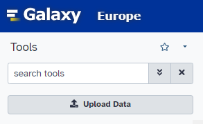
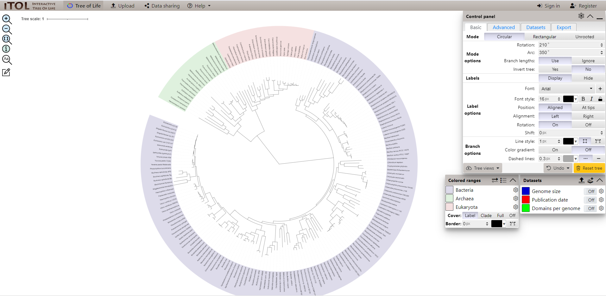

# SSBU CV5: Fylogenetické stromy

## Fylogenetika

#### Prehľad

- Štúdium evolučných vzťahov pomocou genetických údajov, kvantitatívnych znakov a morfológie.
- Molekulárna fylogenetika využíva molekulárne údaje, ako sú sekvencie DNA a bielkovín, na odvodenie fylogenézy, čo sú evolučné vzťahy medzi druhmi alebo sekvenciami.

##### Význam

- Pochopenie života na Zemi (vývoj organizmov)
- Zachovanie biodiverzity - identifikácia evolučne odlišných a globálne ohrozených druhov
- Príbuzenstvá organizmov
- Epidemiológia - sledovanie šírenia chorôb, pochopenie evolúcií patogénov - vývoj vakcín

##### Problémy
- Neúplné záznamy - náročná interpretácia, pochopenie vzťahov
- Rýchle evolučné zmeny - niektoré druhy alebo gény sa vyvíjajú tak rýchlo, že je ťažké presne stanoviť ich fylogenetické vzťahy.
- Výpočtová zložitosť - veľké súbory genetických údajov, vyžadujú výpočtové zdroje a efektívne algoritmy

##### Zdroje údajov
- Genetické alebo morfologické údaje
- Genbank (nukleotidové sekvencie a ich proteínový preklad)
- Biologické databázy: TreeBASE, Dryad Digital Repository - publikované fylogenetické stromy a súbory údajov pre porovnávacie štúdie.

#### Fylogenetický strom
- rozvetvený diagram (strom) zobrazujúci evolučné vzťahy medzi rôznymi biologickými druhmi na základe podobností a rozdielov v ich fyzických alebo genetických vlastnostiach.

##### Typy fylogenetických stromov
- Rozdvojené stromy - Každé dve vetvy sú spojené vnútorným uzlom a tvoria strom.
- Dendrogram - Zovšeobecnenie rozvetveného stromu, ktoré sa používa aj pre nefylogenetické údaje.
- Fylogram - Strom, v ktorom dĺžka vetvy predstavuje váhu vlastnosti.
- Chronogram - Strom, v ktorom vetva predstavuje čas evolúcie.

##### Tvorba fylogenetických stromov (Základné kroky)
1. Vyberte sekvencie, ktoré chcete zahrnúť do stromu (napr. vo formáte BLAST).
2. Zarovnajte sekvencie pomocou softvérových nástrojov (napr. CLUSTAL, MUSCLE, T-Coffee alebo Galaxy).
3. Odhadnite zostavenie stromu:
    - pomocou matice vzdialeností - porovnanie vzdialeností medzi sekvenciami
    - pomocou vlastností - porovnanie rozdielnosti ohodnotených vlastností
4. Vytvorte koreňový strom - použitím výstupnej skupiny, stredový bod, duplikácia génu, UPGMA.
5. Vizualizujte strom (ručne alebo pomocou softvérových nástrojov).

## Softvérové nástroje na fylogenetickú analýzu
- Nevyhnutné na konštrukciu a vizualizáciu fylogenetických stromov.
  
+ Vlastnosti nástrojov vo fylogenetike:
    + Konštrukcia stromov, zarovnávania a vizualizácie.
- Použitie:
    - _Komparatívna genomika_ - Skúma rozdiely a podobnosti medzi genómami rôznych organizmov.
    - _Kladistika_ - Metóda klasifikácie organizmov na základe ich spoločných predkov.
+ Aplikované metódy:
    - *Spájanie susedov* - Jednoduchá metóda na konštrukciu fylogenetických stromov založená na najmenších evolučných vzdialenostiach.
    - *Maximálna šetrnosť* - Metóda, ktorá minimalizuje počet evolučných zmien potrebných na vysvetlenie daných dát.
    - *UPGMA* (Unweighted Pair Group Method with Arithmetic mean) -Jednoduchá metóda na vytvorenie fylogenetického stromu založená na priemerných vzdialenostiach medzi všetkými pármi taxónov.
    - *Bayesovská fylogentická inferencia* - Využíva Bayesovu teóriu na odhad najpravdepodobnejšieho fylogenetického stromu.
    - *Metóda maximálnej vierohodnosti* - Štatistická metóda na výber fylogenetického stromu, ktorý najlepšie vysvetľuje dané dáta.
    - *Matica vzdialeností* - Tabuľka zobrazujúca evolučné vzdialenosti medzi párovými sekvenciami alebo taxónmi, používaná pri konštrukcii fylogenetických stromov.

- Príklady nástrojov vo fylogenetike:

- Nástroje na **výpočet**:

| Názov | Popis | Metódy | Typ |
| --- | --- | --- | --- |
| BEAST | Bayesovská evolučná analýza vzorkovacích stromov | Bayesovský záver, uvoľnené molekulárne hodiny, demografická história | desktop |
| ClustalW | Progresívne viacnásobné zarovnanie sekvencií | Matica vzdialenosti/najbližší sused | EBI PBIL EMBNet GenomeNet |
| fastDNAml | Optimalizovaná maximálna pravdepodobnosť (iba nukleotidy) | Maximálna pravdepodobnosť | desktop |
| Geneious | Poskytuje sofistikované nástroje na výskum genómu a proteómu | Neighbour-joining, UPGMA, MrBayes plugin, PHYML plugin | desktop |
| Mesquite | Softvér pre evolučnú biológiu, ktorý má pomôcť biológom analyzovať porovnávacie údaje o organizmoch. Jeho dôraz je kladený na fylogenetickú analýzu, ale niektoré z jeho modulov sa týkajú populačnej genetiky, zatiaľ čo iné robia nefylogenetické multivariačné analýzy. | Maximálna šetrnosť, matica vzdialenosti, maximálna pravdepodobnosť | desktop |
| MOLPHY | Molekulárna fylogenetika (protein alebo nukleotid) | Maximálna pravdepodobnosť | server |
| MrBayes | Žiadny odhad pravdepodobnosti | Bayesovský záver | desktop |
| Nona | Fylogenetický záver | Maximálna šetrnosť, implicitné váženie, račňa | desktop |

- Nástroje na **zobrazovanie**:
  
| Nástroj | Popis | Typ | |
| --- | --- | --- | --- |
| Aquapony | Prehliadač stromu Javascript pre Beast | online |
| ETE toolkit Tree Viewer | online nástroj na zobrazenie fylogenetického stromu (formát newick), ktorý umožňuje zobrazenie viacerých zarovnaní sekvencií spolu so stromami (formát fasta) | online |
| EvolView | online nástroj na vizualizáciu, anotáciu a správu fylogenetických stromov | online |
| IcyTree | Prehliadač Javascript SVG na strane klienta pre anotované zakorenené stromy. Podporuje tiež fylogenetické siete | online |
| Iroki | Automatické prispôsobenie a vizualizácia fylogenetických stromov | online |
| iTOL - interactive Tree Of Life | komentovať stromy rôznymi údajov a exportovať do rôznych grafických formátov; skriptovateľné cez dávkové rozhranie | online |
| Microreact | Prepojte, vizualizujte a preskúmajte sekvencie a metaúdaje pomocou fylogenetických stromov, máp a časových línií | online |
| OneZoom | používa IFIG (Interactive Fractal Inspired Graphs) na zobrazenie fylogenetických stromov, ktoré je možné priblížiť pre zvýšenie detailov | online |
| ARB | Integrované softvérové prostredie pre stromovú vizualizáciu a anotáciu | desktop (Linux, Mac) |
| BioNumerics | Univerzálna platforma na správu, ukladanie a analýzu všetkých typov biologických údajov, vrátane stromových a sieťových odvodení sekvenčných údajov | desktop (Windows) |
| Bio::Phylo | Zbierka modulov Perl na manipuláciu a vizualizáciu fylogenetických údajov. Bio::Phylo je jednou časťou komplexnej sady biologických nástrojov Perl | desktop (Všetky) |
| Dendroscope | Interaktívny prehliadač pre veľké fylogenetické stromy a siete | desktop (Všetky) |
| DensiTree | Prehliadač schopný zobraziť viaceré prekryté stromy. | desktop (Všetky) |
| JEvTrace | Multivalentný prehliadač na zarovnanie sekvencií, fylogenézu a štruktúru. Vykonáva interaktívnu evolučnú stopu a ďalšie analýzy inšpirované fylogenézou. | desktop (Všetky) |
| ggtree | Balík R na vizualizáciu stromu a anotáciu s podporovanou gramatikou grafiky | knižnica (R) |
| jsPhyloSVG | open-source javascriptová knižnica na vykresľovanie vysoko rozšíriteľných, prispôsobiteľných fylogenetických stromov; používa sa pre Elsevierove interaktívne stromy | knižnica (Javascript) |
| PhyD3 | interaktívna vizualizácia fylogenetického stromu s numerickými anotačnými grafmi, s výstupom SVG alebo PNG, implementovaná v D3.js |  knižnica (Javascript) |
| phylotree.js | phylotree.js je knižnica, ktorá rozširuje populárny rámec vizualizácie údajov D3.js a je vhodná na vytváranie aplikácií JavaScript, kde môžu používatelia prezerať a interagovať s fylogenetickými stromami. | knižnica (Javascript) |
| Fytools | Fylogenetické nástroje pre porovnávaciu biológiu (a iné veci) založené v R | knižnica (R) |
| Toytree | Toytree: Minimalistická stromová vizualizácia a knižnica manipulácie pre Python | knižnica (Python) |

### Nástroj Galaxy

- dostupný na - https://usegalaxy.eu/

- Tento nástroj použijeme na zarovnanie sekvencií DNA.

- Vyhľadávanie rozšírení v Galaxy:
  

- História operácií vykonaných v Galaxy
    - Napr. nahratie údajov, spracovanie, analýza, ..
    - Možnosť pomenovať históriu
    - <ins>Sivá</ins> farba - čakajúca operácia, <ins>Žltá</ins> - prebiehajúca, <ins>Červená</ins> - neúspešná, <ins>Zelená</ins> - úspešná 
  

#### MAFFT

- Použite nástroj MAFFT na zarovnanie DNA sekvencií

- V parametroch nastavte generovanie jednej alebo viacerých MSAs (Multiple Sequence Alignment).
- Ako vstupné dáta nahrajte súbor `exon7-unaligned.fst` z priečinku `input`. (Upload Data pod vyhľadávaním). (viac o exónoch: https://www.genome.gov/genetics-glossary/Exon)
- Po nahratí dát ako `Input Batch` vyberte nahraté údaje.
- Typ sekvencie môžete nechať na auto-detect.
- Ako algoritmus pre spracovanie vyberte FFT-NS-2.

- Výstup zarovnania nastavte na formát FASTA a spustite proces zarovnania sekvencií.
  

- V histórii by ste mali vidieť načítaný dataset a tiež spustenie MAFFT operácie. 
 

- Po dokončení a rozkliknuti výsledku vidíte náhľad výsledku a možnosti ďalších operácií (ikony, napr. Uloženie výsledku). Z týchto ikon použite ikonu pre Vizualizáciu (5. zľava).

- Mali by sa Vám zobraziť dostupné rozšírenia nástroja Galaxy, ktoré sú schopné vytvoriť vizualizáciu z daného výsledku vo vybranom formáte. Vyberte nástroj `Multiple Sequence Alignment`. 

- Vo vizualizačnom nástroji sekvencie zoraďte pomocou `Sorting` podľa 'Seq'. Mali by ste dostať rovnaké výsledky ako na nasledujúcom obrázku. (Skontrolujte názov organizmov a posun v prvých pár sekvenciách).
  

#### IQ-TREE

- Ďalej vyhľadajte nástroj IQ-TREE, ktorý slúži na vytvorenie fylogenetických stromov.

- Ako vstupný súbor zarovnaných sekvencií vyberte výsledok operácie MAFFT, ostatné parametre môžete nechať prázdne, alebo na prednastavených hodnotách. Spustite proces vytvárania stromu.
  

- Spustia sa Vám procesy pre vytvorenie fylogenetického stromu pomocou niekoľkých metód.

- Vyberte strom vytvorený pomocou MaxLikelihood (Metóda Maximálnej Vierohodnosti) a zobrazte nástroje v ktorých ho môžete vizualizovať. Otvorte strom v niektorom z vizualizačných nástrojov.

- V strome môžete skontrolovať vetvenie a závislosti (napr. organizmy začínajúce rovnakým názvom by mali byť v rovnakej vetve a byť v blízkom zhluku).

   
### Nástroj iTOL (Interactive Tree of Life)

- vizualizácia fylogenetických stromov
- tree of life - strom života, základné organizmy podľa taxonómie
- vytvárnie a úprava vlastných stromov (napr. pre publikačné účely)
- plain text formát údajov (.txt)
- dostupný na - https://itol.embl.de/itol.cgi

+ Strom života - niektoré základné druhy organizmov
  

- Na pravej strane sa nachádza panel s nastaveniami vizualizácie stromu, kde viete nastavovať vizuálne prvky. Kliknutím pomocou pravého tlačidla myši viete manipulovať so štruktúrou stromu.
- Skúste napr. vymazať vetvu baktérií, zmeniť typ grafu na hranatý, zobraziť veľkosť genómu pre každý organizmus a pod.
  

- Nakoniec môžete upravený strom exportovať, napr. vo formáte SVG alebo PDF. 

----

