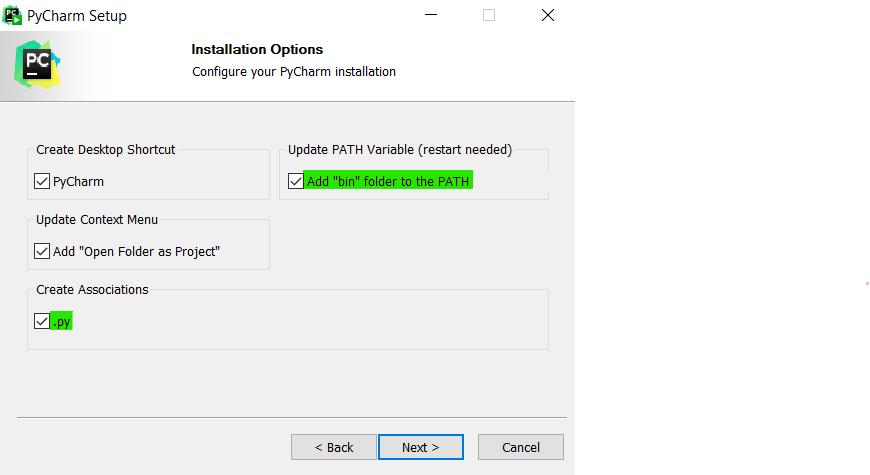
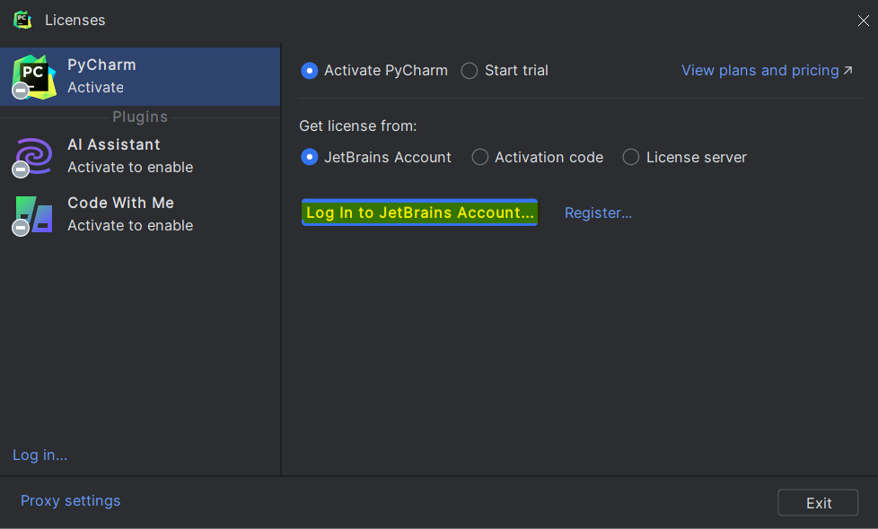
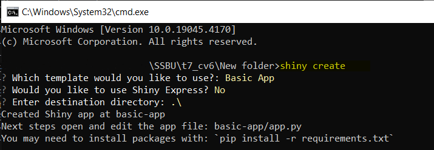
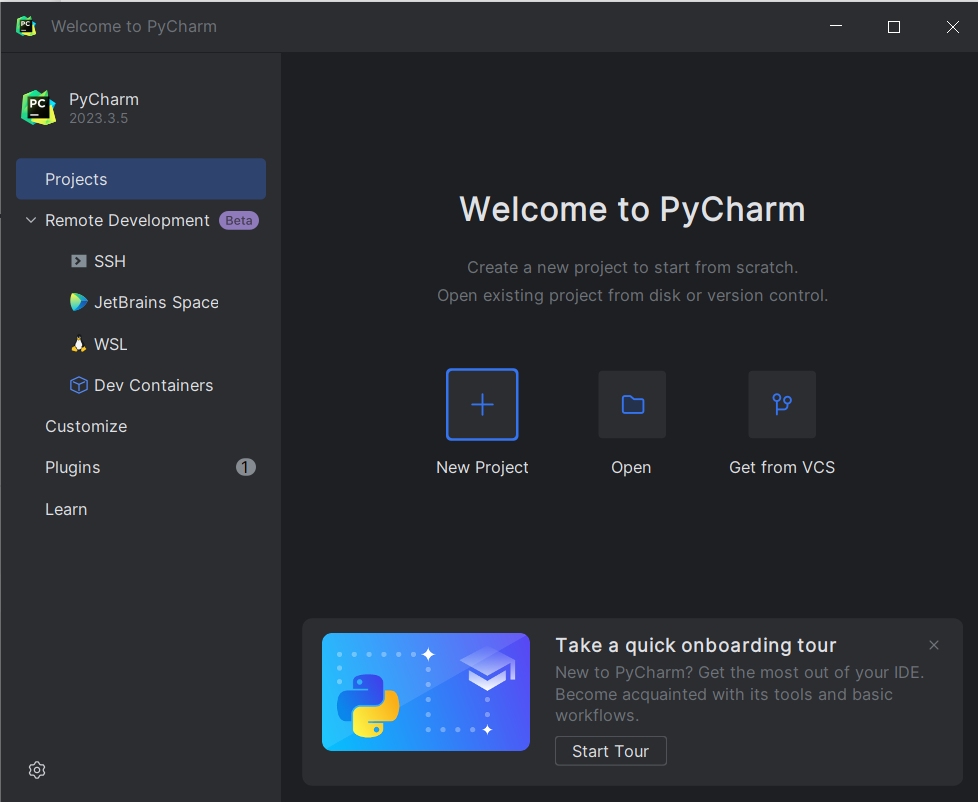
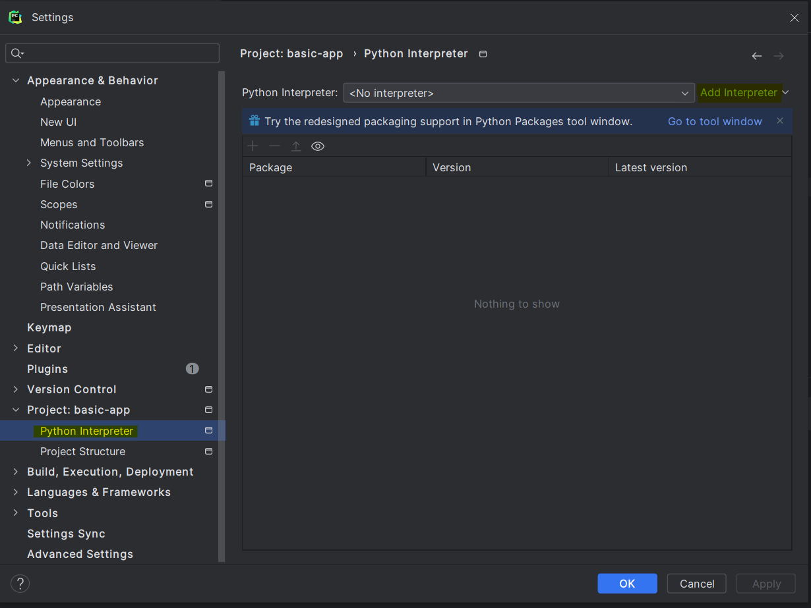
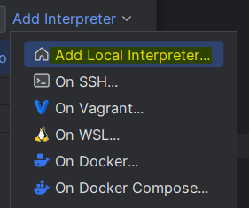
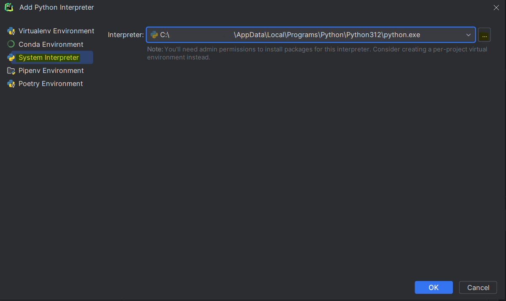
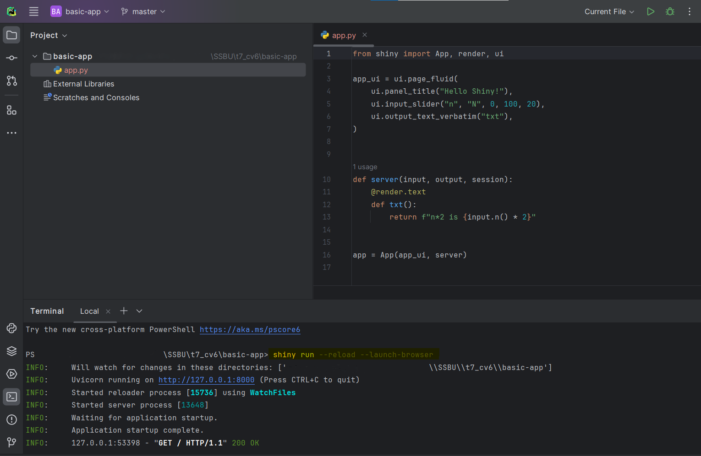
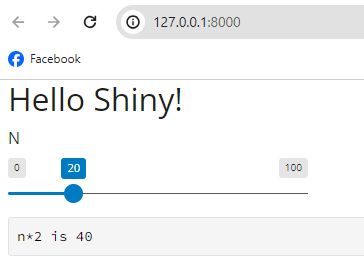

# SSBU CV6: Framework Shiny

### Inštalácia: Inštalácia PyCharm

1. **Výber edície:** Nainštalujte open-source PyCharm Community alebo PyCharm Professional Edition (máte na ňu študentskú licenciu na ISIC).
   **Výhodou Professional Edície je aj to, že v nej dokážete otvárať a spúšťať Jupyter Notebooky :)**

3. **Stiahnutie a Inštalácia PyCharm:** Inštalačný súbor nájdete na strínkach JetBrains. Vyberte verziu, ktorá zodpovedá vášmu operačnému systému (Windows, macOS alebo Linux).

   [Stiahnuť PyCharm](https://www.jetbrains.com/pycharm/download/)

    Spustite stiahnutý inštalačný program a postupujte podľa pokynov na obrazovke, **zaškrtnite možnosť associate .py, add .bin folder to the PATH**.

   

5. **Počiatočné nastavenie:** Pri prvom spustení PyCharmu vás môže program vyzvať, aby ste nakonfigurovali nastavenia, ako sú téma používateľského rozhrania, pluginy a pod. Ak používate Professional Edition, je potrebné prihlásenie do JetBrains konta a aktivácia licencie.

   

### Inštalácia Shiny pre Python

1. **Inštalácia Shiny pre Python pomocou pip:**

   Pomocou príkazového riadku nainštalujte framework Shiny príkazom:

    `pip install shiny`

2. **Vytvorenie aplikácie:**

   Na vytvorenie novej aplikácie Shiny použite v termináli príkaz:

   `shiny create`

   

4. **Otvorenie vytvorenej aplikácie v PyCharm:**

- Otvorte PyCharm.
- Vyberte `Open` z úvodnej obrazovky alebo zvoľte `File > Open` z menu.
- Vyberte priečinok obsahujúci vašu vytvorenú aplikáciu Shiny `basic-app`.

    

4. **Konfigurácia interpretera Pythonu:** (pre Shiny to nie je potrebné)

   Po otvorení vášho projektu vás PyCharm môže vyzvať na konfiguráciu interpretera Pythonu, ak nie je automaticky nájdený:

- Pre nastavenie interpretera choďte do `Settings > Project: basic-app > Python Interpreter`.

  
  
- Ak váš interpreter nie je v zozname, kliknite na `Add Interpreter > Add Local Interpreter`.

  
    
- Vyberte `System Interpreter` a pravdepodobne vám cestu k interpreteru doplní PyCharm automaticky. Ak nie, zadajte cestu k spustiteľnému súboru Pythonu vo vašom systéme. To sa obvykle nachádza v adresári vašej inštalácie Pythonu.

  
  
- Po výbere alebo pridaní interpretera kliknite na `OK` pre dokončenie nastavenia.

5. **Spustenie aplikácie z terminálu v PyCharm:**

- V PyCharm otvorte Terminál.
- Spustite aplikáciu pomocou príkazu `shiny run` s prepínačmi:

  `shiny run --reload --launch-browser`

  

- Na Localhost:8000 sa vám spustí Shiny aplikácia.

  
