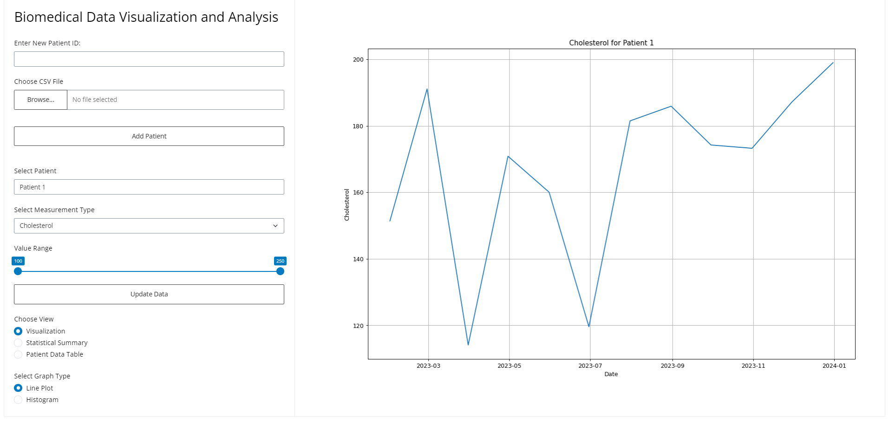

# SSBU CV6: Framework Shiny

## Aplikácia Biomedical Data Visualization and Analysis

    

### Funkcionalita
- Možnosť vybrať pacienta zadaním jeho ID (Defaultne v aplikácii "Patient 1" - "Patient 10").
- Možnosť vybrať meranie pacienta ("Cholesterol", "Blood Pressure", "Glucose").
- Možnosť vyfiltrovať údaje v zobrazenom grafe pomocou posuvníka.
- Zobrazenie výsledkov vo forme grafu, textu (štastistickej sumarizácie), alebo tabuľky údajov pacienta.
- Pri zobrazení grafu - možnosť zobrazenia čiarového grafu hodnôt, alebo histogramu.
- Pri štatistike a tabuľke - možnosť filtrovať údaje podľa jednotlivých meraní.

### Kód
- **app.py**:
    - serverová časť aplikácie (čítanie inputov, spracovanie eventov, a vytváranie a renderovanie outputov)
    - spustenie aplikácie
- **app_ui.py**: používateľské rozhranie aplikácie
    - inputy - názov, dropdown (select), slider, radio button, checkbox, file, ..
    - outputy - text, tabuľka, graf, dynamický komponent (je možné mu dynamicky priradiť aký typ bude mať)
- **data_init.py**: definícia potrebných listov, slovníkov, vygenerovanie počiatočných dát pacientov a pod.
- **data_init.py**: funkcionalita aplikácie (vytváranie grafov, textu, generovanie a pridanie nových údajov pacienta a pod.)

### Úloha na cvičenie

Kód aplikácie nájdete v priečinku `code`.

Otvorte aplikáciu v PyCharme a spustite pomocou príkazu: `shiny run --reload --launch-browser`

Do aplikácie je potrebné naimplementovať pridanie nového pacienta. Toto pridanie je možné realizovať dvomi spôsobmi (naimplementujte oba):
1. Zadanie ID pacienta - pokiaľ používateľ zadá len ID pacienta a nenahrá žiadny súbor, nahrá sa do zoznamu pacientov ID pacienta, a vygenerujú sa k nemu údaje.
2. Nahranie CSV súboru - ak používateľ nahrá CSV súbor, všetky údaje sa načítajú z neho (vstup v poli pre ID pacienta sa neberie do úvahy) a pridajú sa do zoznamu pacientov. Súbor s údajmi pre nového pacienta nájdete pri zdrojovom kóde (`new_patient_data.csv`).  

V kóde nájdete **TODO komentáre** (choďte postupne podľa čísel 1 až 6). TODO komentáre v PyCharme zobrazíte cez `View > Tool Windows > TODO`.

Po dokončení by aplikácia mala vyzerať nasledovne a mala obsahovať funkcionalitu pridania pacienta:

    

