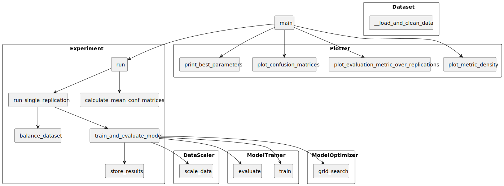

# CV7: Úvod do strojového učenia v Pythone

## Aplikácia

Aplikácia v priečinku machine_learning demonštruje použitie strojového učenia na datasete UCI ML Breast Cancer Wisconsin (Diagnostic) z knižnice scikit-learn [1].

Aplikáciu otvorte v programe PyCharm. Pri otváraní aplikácie zvoľte možnosť vytvorenia **nového virtuálneho prostredia**. Ak je potrebná konfigurácia **Python interpretra**, postup nájdete v súbore `t7_cv6/CV6_1_Instalacie.md`.

V adresári **project**, sa nachádza súbor `requirements.txt`, ktorý obsahuje zoznam knižníc, ktoré je potrebné nainštalovať pred spustením aplikácie.

Adresár **other** obsahuje skripty pre demonštráciu exploračnej analýzy, normalizácie a štandardizácie údajov.

Adresár **machine_learning** obsahuje main skript pre beh analýzy datasetu pomocou strojového učenia, a ďalšie skripty, v ktorých je implementovaná logika pre beh experimentov. 

Prehľad implementovaných tried a volaní metód: 

Do adresára **outputs**, sú ukladané logy a výstupy aplikácie (napr. diagramy).

----
#### Referencie

[1] https://scikit-learn.org/stable/modules/generated/sklearn.datasets.load_breast_cancer.html